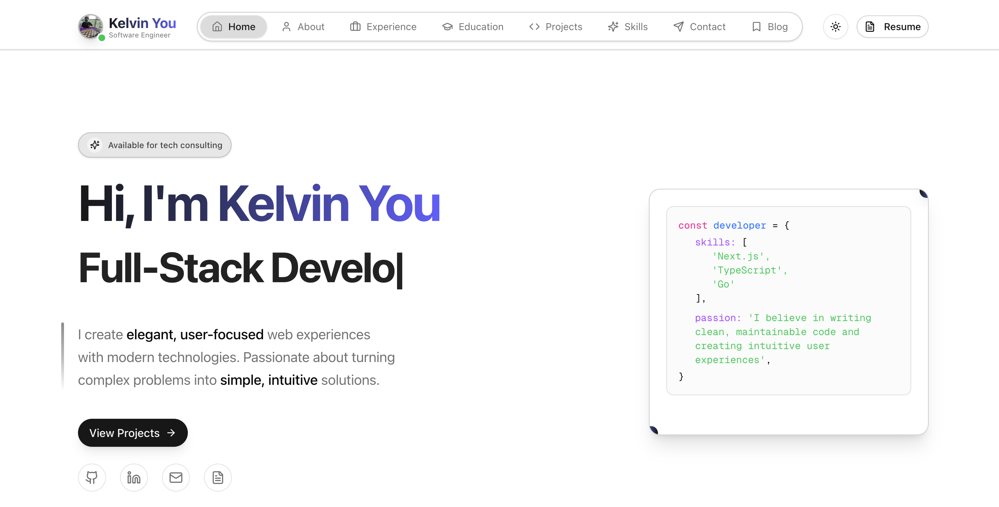

# Kelvin You — Portfolio

[**kelvinyou.vercel.app**](https://kelvinyou.vercel.app)



Personal portfolio and blog. Next.js 16 (App Router) + React 19 + TypeScript 5 +
Tailwind CSS 4, deployed on Vercel.

Not a template — the content in `src/constants/data.ts` is mine. Fork it if the
structure is useful to you, but expect to replace that file wholesale.

## Features

- **Portfolio** — experience, projects, education, and skills from one typed
  source of truth (`src/constants/data.ts`)
- **Blog** — MDX posts with GFM, syntax highlighting, and Mermaid diagrams;
  statically generated, revalidated hourly
- **i18n** — English / 中文 / Bahasa Melayu via `next-intl`, routed under `/[locale]`
- **Resume** — in-browser PDF rendering with `@react-pdf/renderer`
- **MDX editor** — authoring UI at `/[locale]/mdx-editor`
- **Light / dark mode** — `next-themes`, no flash on load
- **SEO** — generated `sitemap.xml` and `robots.txt`, per-page metadata
- **Motion** — Framer Motion, scroll-triggered and animate-once

## Getting Started

Requires Node.js 20.9+ and npm.

```sh
git clone https://github.com/KelvinYou/portfolio-website.git
cd portfolio-website
npm install
npm run dev
```

Open [http://localhost:3000](http://localhost:3000).

The site runs fully without configuration. Blog comments and view counts are
Firebase-backed and stay inert until you supply credentials — create
`.env.local`:

```env
NEXT_PUBLIC_FIREBASE_API_KEY=
NEXT_PUBLIC_FIREBASE_AUTH_DOMAIN=
NEXT_PUBLIC_FIREBASE_PROJECT_ID=
NEXT_PUBLIC_FIREBASE_STORAGE_BUCKET=
NEXT_PUBLIC_FIREBASE_MESSAGING_SENDER_ID=
NEXT_PUBLIC_FIREBASE_APP_ID=
NEXT_PUBLIC_FIREBASE_MEASUREMENT_ID=
```

Firestore access rules live in `firestore.rules`.

## Scripts

| Command | Purpose |
|---------|---------|
| `npm run dev` | Dev server (Turbopack) |
| `npm run build` | Production build — also the type/lint gate |
| `npm run build:analytics` | Build with bundle analysis (`ANALYZE=true`) |
| `npm run start` | Serve the production build |
| `npm run lint` | ESLint (`lint:fix` to autofix) |
| `npm run typecheck` | `tsc --noEmit` |

## Project Structure

```
src/
├── app/
│   ├── [locale]/       # (main) site + (admin) MDX editor
│   ├── api/            # Route handlers (locale-independent)
│   └── sitemap.ts …    # robots.ts, feed.xml, global metadata
├── components/         # sections/, ui/ (shadcn), blog/, gallery/, layout/
├── constants/data.ts   # ALL portfolio content — single source of truth
├── content/blog/       # MDX posts
├── i18n/               # next-intl routing + request config
├── messages/           # en.json / zh.json / ms.json
├── lib/                # utils, animations, mdx, firebase
└── types/              # shared TypeScript types
```

Conventions (named exports, Tailwind-only styling, the design system) are
documented in [CLAUDE.md](CLAUDE.md).

## License

MIT — see [License.txt](License.txt). The license covers the code, not the
personal content, résumé, or images.

## Built With

[Next.js](https://nextjs.org/) · [TailwindCSS](https://tailwindcss.com/) ·
[shadcn/ui](https://ui.shadcn.com/) · [Framer Motion](https://www.framer.com/motion/) ·
[next-intl](https://next-intl.dev/)
