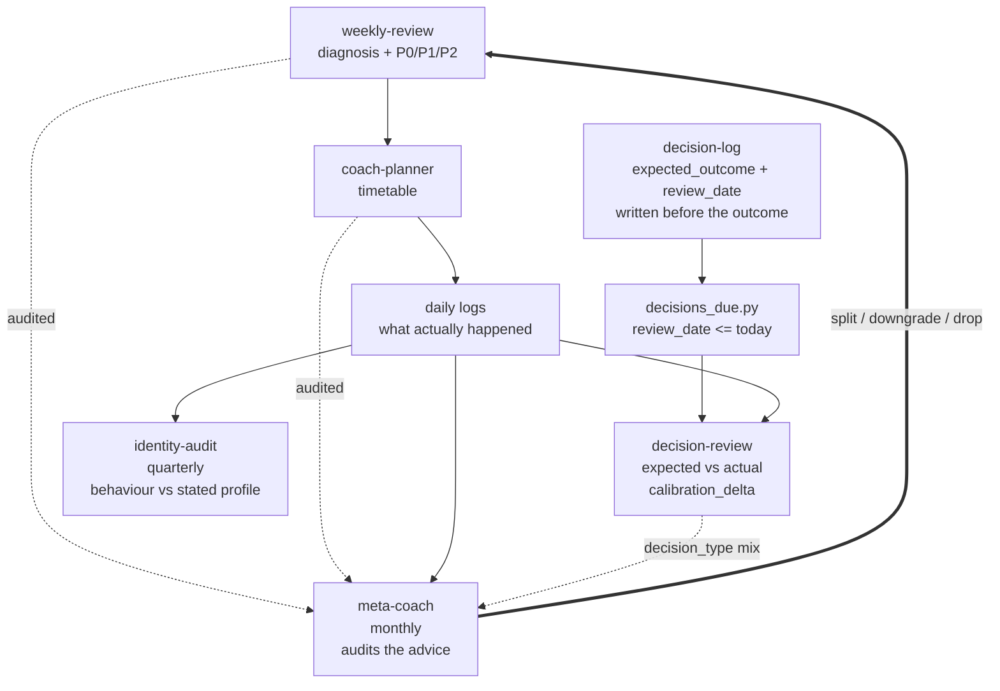

Personal-OS runs a dozen or so agent skills on a weekly cadence. `weekly-review` scores the week and emits P0/P1/P2 objectives. `coach-planner` turns those objectives into a schedule. `wealth-manager` looks at money. `learning-agent` looks at what to study next.

For months, every one of them had the same property: **the advice was never checked.**

Not "checked badly" — not checked at all. Each week produced a fresh report with fresh recommendations, and the previous week's recommendations simply evaporated. The system had a memory of what I *did* and no memory of what it *told me to do*. Which means it could give me the same bad advice indefinitely and nothing in the architecture would ever notice.

That's the default state of almost every agent project I've seen. The build stops at "the agent gives advice." The second-order loop — *was the advice any good?* — is left as an exercise for the human, who does not do it.

## The trust problem: self-grading is unfalsifiable

The obvious fix is to ask the agent. Feed last week's report back in, add "critique your own recommendations," and read the critique.

This is worthless, and it's worth being precise about why. The same model that produced a bad recommendation will rate that recommendation reasonable, because the reasoning that generated it is the reasoning now evaluating it. If the plan was over-optimistic, the grader shares the optimism. If the diagnosis missed a confounder, the grader misses the same confounder. You get a critique that finds tone problems and formatting nits, and never finds "this whole objective was misconceived."

Worse, the grader has access to the outcome. Once you know how the week went, *any* prior recommendation can be narrated as either vindicated or defeated by circumstance. Hindsight makes advice unfalsifiable — there is always a story where the plan was correct and the world got in the way. Two of my skills are explicitly built around suppressing exactly this move.

So a self-review loop produces a document that reads like accountability and contains none. It fails in the most expensive way available: it *looks* like the problem is solved.

## The missing ingredient is a pre-registered prediction

The instinct is to write a better rubric. More criteria, sharper prompts, a scoring scale. That's the wrong axis entirely.

What makes a judgement checkable isn't the quality of the judge. It's whether there was a **claim on record before the outcome was known**. Clinical trials don't get their credibility from better statisticians; they get it from pre-registration. You state the endpoint, then you look. The order matters more than the rigour.

Which means the audit infrastructure is not a smarter reviewer. It's a write-once record, timestamped before reality lands.

## decision-log: writing the expectation down first

`decision-log` exists to capture non-trivial decisions at the moment they're made. Its whole design constraint is speed — you give it one sentence of brain dump, it infers the structured fields, you correct anything it got wrong. The schema lives in `templates/decision.md`:

```yaml
id:                       # YYYY-MM-DD-<slug>，与文件名一致
date_decided:             # YYYY-MM-DD
category:                 # career | finance | health | relationship | project | tooling
stakes:                   # medium | high (low 不记)
reversibility:            # easy | costly | irreversible
decision_type:            # proactive | reactive | default
expected_outcome:         # 1 句话，必须可证伪
review_date:              # 触发回顾的日期（默认 +30d）
status:                   # open | reviewed | pushed | expired
# 以下字段由 /decision-review 写入
actual_outcome:           # null 直到 review
calibration_delta:        # null | "as_expected" | "better" | "worse" | "too_early" | "irrelevant"
confidence:               # null | 0.0-1.0
lesson:                   # null | 1-2 句话
```

Three fields carry the entire load.

**`expected_outcome` must be falsifiable.** Not "this should go well" — a statement that could be checked by a stranger with the data. Illustratively: *"switching my deep-work block to 06:00 will get me ≥ 12 focused hours a week, sustained for a month."* That can be wrong. "I'll be more productive" cannot.

**`review_date` is set at write time**, defaulting to +30 days. The moment to decide when you'll check is *before* you have any information about how it's going. Choosing the review date afterwards is just choosing the date that flatters you.

**The review fields are explicitly null until a different skill fills them.** The skill definition spells this out as a prohibition: `decision-log` 不修改 `actual_outcome` / `calibration_delta` / `lesson`. Recording and grading are separate operations, and the recorder doesn't get to do both.

There's a fourth thing I like more than I expected to: the `stakes` gate. Only `medium` and `high` get logged — `medium` means it affects at least a month, `high` means it changes at least a year of trajectory. Lunch choices don't go in. A log that captures everything captures nothing, because you stop writing to it by week three.

## decision-review: comparing against a record you can't edit

`decision-review` runs when things come due. `scripts/decisions_due.py` is the trigger — it walks `data/decisions/*.md`, parses frontmatter, and returns everything where `status` is `open` or `pushed` and `review_date <= today`:

```python
status = meta.get("status")
if status not in ("open", "pushed"):
    continue
raw_review = meta.get("review_date")
...
if review_date <= today:
    due.append((p, meta))
```

Deliberately dumb. The queue is a date comparison over files on disk, not a model deciding what's worth revisiting — because a model deciding what's worth revisiting will quietly skip the uncomfortable ones.

The review itself has one rule that does most of the work. From the skill definition:

> **expected_outcome 不可修改**：防止事后合理化。Review 时先展示原文，再引导写 actual

The original prediction is shown verbatim, first, and cannot be amended. Then, and only then, do I write what actually happened. Reverse that order and the whole exercise collapses into retrofitting the prediction to the result — which is what unstructured self-reflection does every single time.

The `calibration_delta` enum is intentionally coarse: `as_expected` / `better` / `worse` / `too_early` / `irrelevant`. I resisted the urge to make it a numeric score. A five-way categorical is something I'll actually answer honestly; a 1–10 scale invites me to split hairs and drift toward 7.

`too_early` is the escape hatch that keeps the whole thing honest. If the outcome genuinely isn't legible yet, the decision gets pushed — `status` → `pushed`, `review_date` += 30d — rather than forced into a verdict. Without it, every ambiguous case gets scored `as_expected` just to clear the queue.

And `irrelevant` is the category I underrated. Sometimes the decision turned out not to matter at all. That's a real and useful finding about my judgement — I spent deliberation on something inert — and it deserves a slot rather than being smeared into "as expected."

## meta-coach: auditing the advice, not the person

`decision-review` grades my decisions. `meta-coach` grades *the agents*, monthly. The distinction is the first line of the skill and it's load-bearing:

> **审计 agent，不审计用户**：不说"你没完成 P0"，说"coach-planner 连续 3 周排入此目标但从未达成，建议是否应该拆小或放弃"

Same data. Opposite subject. "You failed to complete your P0" makes the human the defect. "coach-planner has scheduled this objective three weeks running and it has never been achieved — should it be split, downgraded, or dropped?" makes the *recommendation* the defect. Only the second framing is actionable by the system, and only the second one I'll read twice.

It audits four things, all of them properties of the advice rather than the advisee:

- **Plan vs Reality Delta** — planned deep-work blocks from `coach-planner`'s timetables against actual `deep_work_hours` in the daily logs. A completion rate, per week.
- **Repeated Misses** — P0/P1 objectives that appear for ≥ 3 consecutive weeks without being achieved. Recurrence is the signal: one miss is life, three is a badly specified objective.
- **Optimism Index** — the rolling mean of that completion rate. Under 70% is flagged as "plan 太乐观," and the recommendation goes to the planner: schedule fewer things per week.
- **Self-Justification Flags** — this one is the sharpest. It counts attribution patterns in the weekly reports — "心智过载", "熔断", "外部干扰", "时间不够" — and flags any that recur ≥ 3 weeks. The skill is careful about what that means: it isn't accusing me of making excuses. It's asking whether `weekly-review` has developed a habit of *supplying* them.

That last check is only possible from outside. `weekly-review` cannot detect that it reaches for "mental overload" every time a target slips, because from inside a single report each instance looks like an accurate observation. The pattern exists only across reports, and only to a reader whose job is the reports rather than the week.

`meta-coach` also has a refusal list: no score, no editing the reports or timetables it audits, no touching thresholds or circuit breakers. It reads and describes. An auditor with write access to what it audits is not an auditor.

And it declines to run on thin data. It needs ≥ 4 weekly reports and ≥ 4 timetables, and if they aren't there it tells me how many more weeks are needed instead of generating an analysis. A pattern claim over two data points is worse than silence, because it comes with the same confident formatting.



## What this catches that self-review cannot

Three failure classes, none of which a single-pass self-critique will find.

**Chronic over-scheduling.** Any one week's plan is defensible. A 65% completion rate across four weeks is not a series of unlucky weeks — it's a planner with a systematic bias, and the correction is structural (schedule less) rather than motivational (try harder).

**Zombie objectives.** An objective that has survived three re-plannings without moving is being copied forward, not chosen. Inside a single weekly report it looks like commendable persistence. Across four, it looks like what it is.

**Narrative drift.** When the same attribution appears in every report, the explanation has stopped being a finding and become a template. That is invisible from inside the document that contains it.

There's a fourth loop above all of these. `identity-audit` runs quarterly, needs ≥ 12 weeks of logs, and does something even the meta-audit doesn't: it infers from behavioural data alone what I actually prioritised — time allocation, spending categories, the distribution of decision categories in the journal — and puts that beside what `data/user_profile.md` claims I prioritise. It reads no self-narration at all. It also refuses to score or recommend; it prints the gap and states plainly that a gap isn't necessarily a problem — priorities legitimately evolve. If the gap bothers me, I can change the behaviour or change the profile. That's my call, not the auditor's.

## Why the auditor must not also be the planner

The separation between `weekly-review` and `coach-planner` looks like ordinary modularity and isn't. `weekly-review` looks backward: aggregate, score across four dimensions, enforce circuit breakers, emit objectives — and explicitly **no timetables**. `coach-planner` owns all scheduling, daily through next-week, and is the sole owner of it.

The reason is that scoring and scheduling have opposed incentives over the same artifact. A skill that both sets the objectives and grades their completion can always adjust one to satisfy the other, and the cheapest direction is downward — quietly plan less so the score looks better. Splitting them means the objectives come from a process that doesn't have to execute them, and the schedule comes from a process that doesn't get to grade itself.

`meta-coach` sits one level up and follows the same logic harder: it produces no advice at all. It cannot fix the planner's optimism by planning differently, only by reporting it. If the auditor could also plan, "the plan is too optimistic" and "here is a better plan" would collapse into one step, and the finding would disappear into the fix — with no record that the original advice was ever wrong.

Which is the same discipline as `expected_outcome` being immutable, applied to skills instead of fields: **the thing being evaluated must not be able to edit the evaluation.**

## The honest limits

I have no numbers for any of this. No calibration score, no "the audit caught N bad recommendations." The payoff I'm claiming is structural — the loop now exists, the records are write-once, the pre-registration is enforced by a schema and a prohibition rather than by my good intentions. Whether it measurably improves the advice is not something I can demonstrate yet, and I'm not going to publish a metric I haven't got.

Some real constraints. `calibration.py` prints a delta distribution and category counts, and its own output says it needs ≥ 5 reviewed decisions before the analysis means anything — Brier scoring requires the `confidence` field, which is backfilled at review time and often left null. The monthly and quarterly cadences mean feedback arrives slowly by construction: a badly specified objective can survive three weeks before `meta-coach` sees it, and that's the design working as intended, not a bug to tune away. And an audit I don't read changes nothing; the infrastructure guarantees the record exists, not that I act on it.

## What generalizes

**A prediction written after the outcome is not a prediction.** The cheapest possible upgrade to any advice-giving system is a timestamped `expected_outcome` and a `review_date`, both fixed before reality arrives. No model improvement competes with that, because it's not a capability problem — it's an ordering problem.

**Make the record immutable, not the reviewer virtuous.** `expected_outcome` 不可修改 does more for honesty than any amount of "be objective" in a prompt. Prompts are suggestions to a model; schema prohibitions are properties of the system.

**Audit the advice, not the human.** Same data, but "your P0 was missed three weeks running" is a verdict on a person and "this objective has been scheduled three times and never achieved" is a bug report against a planner. Only one of those tells you what to change.

**Give the auditor no write access to what it audits.** No score, no edits, no thresholds, no plan of its own. An auditor that can fix things will fix them, and the record of what went wrong disappears into the fix.

The code is at [github.com/KelvinYou/personal-os](https://github.com/KelvinYou/personal-os). The second-order loop is the part I'd build first next time — it's cheaper than the advice layer, and without it you can't tell whether the advice layer is worth anything at all.
