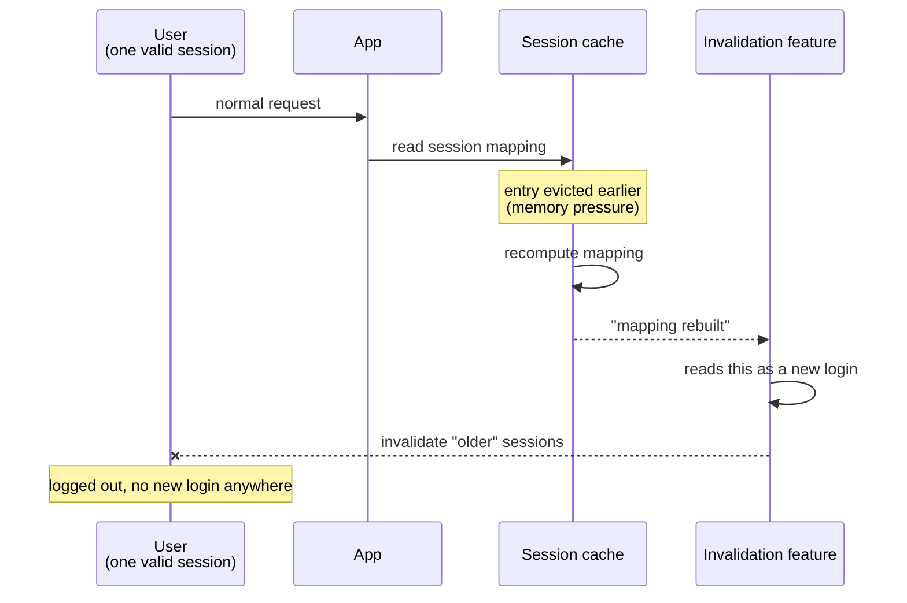
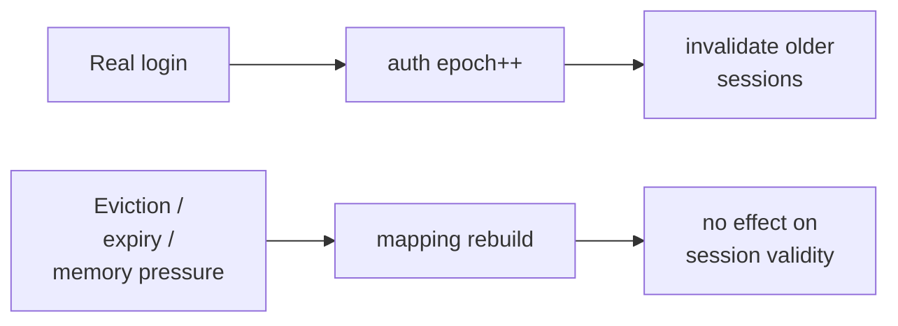

**TL;DR**

- A single-session-per-account feature — new login invalidates old sessions — needs a reliable signal for "a new login just happened."
- It was wired to fire on a cache-mapping rebuild, which is a much broader event than authentication: caches also rebuild for eviction, expiry, and memory pressure, none of which are logins.
- A routine cache eviction rebuilt a long-lived session's mapping, the system read that as a fresh login, and force-logged-out a completely valid session.

The feature itself is a standard control: if an account logs in from a new session, older sessions for that account should stop being valid. The implementation detail that mattered was *what counts as "logged in."*

The team reached for a signal that was already firing near the right place in the code — a cache-mapping rebuild that happened to run right after successful authentication — instead of an explicit, dedicated authentication event.

```ts
// Fires on every rebuild of the session mapping.
onSessionMappingRebuilt(accountId, (session) => {
  invalidateOtherSessions(accountId, keep: session.id);
});
```

## Why the proxy signal looked correct

Most of the time, a mapping rebuild *did* happen because of a fresh login. The two events were correlated closely enough, for long enough, that nobody had reason to suspect they weren't the same thing.

| | Real login | Cache eviction + recompute |
| :--- | :--- | :--- |
| Mapping rebuilt | yes | yes |
| Triggered by user action | yes | no |
| Should invalidate other sessions | yes | **no** |
| Distinguishable at the callback | — | not at all |

That last row is the whole bug. By the time the callback runs, both causes look identical.

## What actually broke it



The feature did exactly what it was designed to do — kick out the old session. There was no old session. There was one session, and the system invalidated it against itself.

## The fix

An explicit authentication epoch, issued by the identity provider only on real authentication and decoupled entirely from cache lifecycle:

```ts
// Only ever incremented by the identity provider, on actual auth.
onAuthEpochAdvanced(accountId, (epoch) => {
  invalidateSessionsBelow(accountId, epoch);
});
```

Cache rebuilds can now happen as often as memory pressure demands without touching session validity at all.



## The transferable part

If a security-relevant decision — kick out a session, revoke a token, force a re-auth — is wired to a signal merely *correlated* with the real event rather than *definitionally* the real event, it will eventually fire on the correlation without the cause.

The fix is almost always the same: find or create a signal that exists only when the real event happens, and refuse to reuse an infrastructure side effect — even a very reliable-looking one — as a stand-in for it. "It fires right after login" is not the same claim as "it fires only on login," and the gap between those two is where the incident lives.
