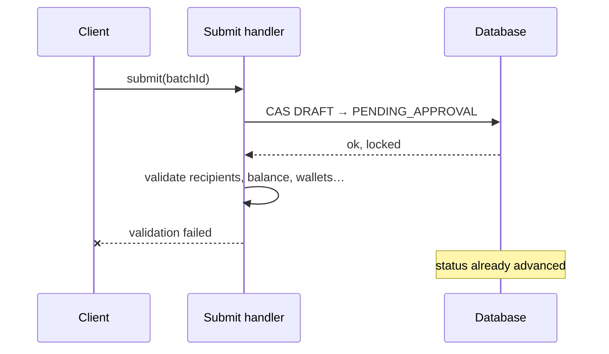
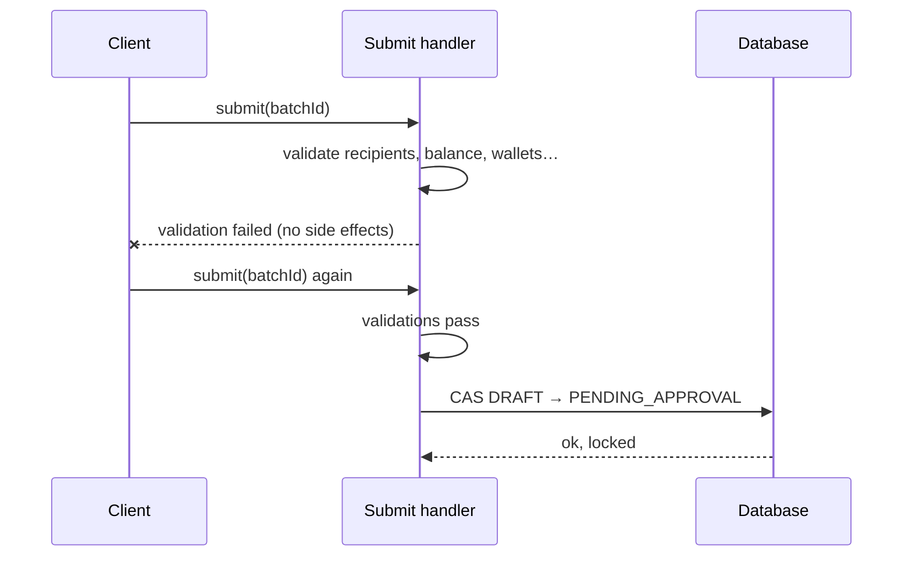

**TL;DR**

- A double-submitted batch payment must not pay twice, and this flow has no idempotency key anywhere.
- The guard is a compare-and-set on the status column — `UPDATE … WHERE status = 'DRAFT'`. Duplicates reject rather than replay.
- The real lesson is ordering: every fallible check runs *before* the lock, so a rejected submit leaves no side effects at all.

Someone double-clicks submit on a batch payment. Or their connection drops after the request lands but before the response returns, and the client retries. Either way two requests arrive to dispatch the same batch, and only one of them may.

The textbook answer is an idempotency key: client generates a UUID, server stores the response against it, duplicates replay the stored result. It's a good pattern. This flow doesn't use it, and the substitute is worth writing down because it's smaller and it fits the domain better.

## The guard is one UPDATE

```sql
UPDATE approval_request
   SET status = 'PENDING_APPROVAL'
 WHERE id = ? AND status = 'DRAFT'
```

If the update touches zero rows, the caller throws. That's it.

The status column doubles as the lock. Whichever request wins the race flips `DRAFT → PENDING_APPROVAL` atomically; the loser's `WHERE` clause no longer matches, it updates nothing, and it fails loudly. No version column, no optimistic-locking annotation, no separate idempotency table.

Note the behaviour on a duplicate: it **rejects**, it does not replay. That's a deliberate difference from an idempotency key and it's the right call here, because the client-side situations that produce a duplicate — double-click, back-then-resubmit — are ones where an error is more honest than a silently successful no-op. A batch has a durable identity and a detail page; "this batch has already been submitted" is a better outcome than pretending to submit it again.

A compare-and-set on a state column only works if the state machine is genuinely linear at that point, which for `DRAFT → PENDING_APPROVAL` it is. It generalises badly. But where it applies, it costs one clause.

The same shape guards approval, where two concurrent final approvals would otherwise each lock an FX quote and each fire off execution.

## The ordering bug is the actual lesson

The CAS is easy. What took a fix was where it sits relative to everything else.

The original order was: lock first, then validate.



The failure mode: a validation error leaves the batch advanced past `DRAFT`. It is no longer editable, no longer submittable, and no longer in a state the user can reason about. Whether it recovers depends entirely on whether the surrounding transaction rolls back — which is a fragile thing to make correctness depend on, especially once any step in the handler talks to something that isn't the database.

The fix is to move every read-only check ahead of the CAS:



Now a rejected submit leaves the draft exactly as it was, regardless of transaction semantics. The batch stays editable, the user fixes the flagged row, they submit again.

Stated generally: **do all the work that can fail before you take the lock, and nothing that can fail after.** The lock should be the last thing that can go wrong, not the first.

That ordering also makes the validations honest. Anything running after the CAS is running on a batch that has already committed to advancing, which creates pressure to "handle" failures by patching state rather than refusing. Ahead of the lock, refusing is free.

## Serialising draft edits

Different problem, same neighbourhood. Before submit, a draft is being edited — and edited concurrently more often than you'd guess. The motivating race wasn't two users; it was **one** user whose page-load autosave fired at the same moment as their own edit. Both reads saw the same snapshot, both wrote back a full row set, and the later write clobbered the earlier one.

The fix is a row lock on the batch, taken by every mutating path:

```kotlin
val batch = repository.getOneByIdForUpdate(batchId)   // SELECT … FOR UPDATE
```

Save takes it, cancel takes it, approve takes it explicitly so a concurrent cancel can't commit underneath a batch that's mid-approval.

Underneath, row persistence moved from delete-all-then-insert-all to a **diff-upsert keyed on row number**: rows present in the request are updated in place, unseen row numbers are inserted, and row numbers absent from the request are deleted. The client always sends the complete set, so absence is a reliable signal of deletion. Rows keep their identities across saves instead of being churned on every keystroke-debounce.

## The NULL that a unique index doesn't catch

There's a unique index on `(batch_id, row_number)`. It looks like it makes the diff-upsert safe. It doesn't, and the reason is a SQL detail that's easy to know and easy to forget under load:

**a unique index does not constrain NULLs.** Two rows with a null `row_number` do not collide, because in SQL `NULL != NULL`.

So a client that omitted `row_number` inserted a brand-new row on *every* autosave tick, and the index raised nothing. A one-second-debounced autosave on a form open for ten minutes generates hundreds of ghost rows — each of which would then be promoted into its own real payment at submit.

The fix isn't a partial index or a sentinel value. It's rejecting the request:

```kotlin
require(items.all { it.rowNumber != null }) { "row number is required" }
```

The constraint the schema *appears* to express is "every row has a unique number." What it actually expresses is "every row that has a number has a unique one." Closing the gap means making the nullable case unrepresentable at the boundary, because you can't make it unrepresentable in the index.

Worth generalising: whenever a uniqueness constraint is load-bearing, check whether the columns are nullable. If they are, the constraint has a hole in exactly the shape of the value your client forgets to send.

## Draft rows versus real rows

One more, because it's the kind of thing that only shows up on old data.

Draft rows live in a separate table from the committed payment rows. Pre-submit the draft table is authoritative; post-submit the drafts are cleaned up and the committed rows take over. Clean, until an older batch turns out to have both — draft rows from a later edit, and stale committed rows from an earlier submission.

The instinct is "prefer committed rows if they exist," which is exactly backwards: in that state the committed copy is the *stale* one. The resolver has to ask "are there live draft rows?" and prefer those, falling back to committed only when there are none.

The general shape: when two tables can both hold a version of the same entity, "which table" is not enough information to decide which is current. You need a rule about *lifecycle stage*, and the rule has to be written where both readers can see it.

## What I'd keep

The CAS-on-status trick is the smallest correct thing for a linear transition, and I'd reach for it again before an idempotency table. But the CAS is not what made this correct. What made it correct was:

1. every fallible check runs before the lock, so failure is side-effect-free
2. concurrent edits serialise on an explicit row lock, not on hope
3. the uniqueness constraint that guards the row set actually constrains the values the client sends

Each of those is a bug I could have shipped without noticing, because all three fail *intermittently* and none of them fail on a machine where you're the only user.

---

*This describes a design pattern from production work on a payments platform. All identifiers, schema and code shown here are generic reconstructions of the idea, not the original implementation.*
