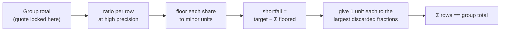

**TL;DR**

- One FX quote is locked on a group total, but the debit is persisted per row — and nothing forces the two to agree.
- Round each row independently and the executed trade no longer matches the quote. Largest-remainder allocation makes the parts sum to the whole by construction.
- The bug that actually cost time was prorating on amount instead of amount+fee. It is invisible until a row fails, so only a partial-failure test catches it.

A batch payment takes one funding wallet and pays out many rows, potentially in several currencies. To do that it buys the payout currencies — one FX quote per currency group, locked at approval time — and then debits the funding wallet.

The quote is locked on the **group total**. The debit is recorded **per row**. Everything hard about this lives in the gap between those two sentences.

## Three rows sharing 1.00

Take the smallest possible version. One group, total `1.00`, three identical rows.

Each row's share is `0.3333…`. Round each independently to two decimals and you get `0.33`, `0.33`, `0.33`. Sum: `0.99`.

You locked a quote for `1.00`. You persisted rows summing to `0.99`. One cent has no owner.

A cent doesn't matter. What it *indicates* does: the per-row numbers and the executed trade are computed by different paths, and nothing forces them to agree. Downstream, the actual FX order is built by re-summing the persisted rows:

```kotlin
val sellAmount = rows.sumOf { it.fundingDebitAmount }
```

So the trade that executes is for the sum of the rounded rows — not for the amount that was quoted and locked. The discrepancy is a cent today and an arbitrary number of cents on a batch with more rows and less friendly ratios. Either way you have a reconciliation break that is nobody's fault and very annoying to trace.

## Largest-remainder allocation

The fix is to stop treating rows as independent. Allocate the exact target across them, in minor units, and distribute the rounding error explicitly.

```kotlin
fun allocateLargestRemainder(
    target: BigDecimal,
    rawShares: List<BigDecimal>,
): List<BigDecimal> {
    val targetCents = target.movePointRight(2).setScale(0, RoundingMode.HALF_UP)
    val flooredCents = rawShares.map { it.movePointRight(2).setScale(0, RoundingMode.DOWN) }

    // Everyone is short by definition — floor never overshoots.
    var toDistribute = (targetCents - flooredCents.sum()).toInt()

    // The rows that lost the most to flooring get the spare cents back first.
    val order = rawShares.indices.sortedByDescending { i -> fractionalPart(rawShares[i]) }

    val out = flooredCents.toMutableList()
    for (i in order.take(toDistribute)) out[i] += 1
    return out.map { it.movePointLeft(2) }
}
```

Floor every share, count how many minor units are missing, and hand them to the rows with the largest discarded fraction. The sum equals the target **by construction**, not by luck.

Three rows sharing `1.00` now yields `0.34 / 0.33 / 0.33`. Someone gets the extra cent. That's fine — what isn't fine is the cent existing nowhere.



## The basis is the part that bites

The allocation above is textbook. The bug that actually cost time was choosing what to allocate *proportionally to*.

Rows carry an amount and a transfer fee. The debit basis is the sum:

```
rowGross = amount + fee
```

It's tempting to prorate by `amount`, because the amount is the number the user thinks about. That's wrong, and it's wrong in a way that stays hidden until rows start dropping out.

Two rows in one currency group:

| row | amount | fee | gross |
|---|---|---|---|
| A | 100 | 1 | 101 |
| B | 100 | 50 | 150 |

Group gross is `251`, and suppose you-pay is also `251`. Both rows settle: prorating by amount or by gross both give `251.00`. The bug is invisible.

Now **row B fails** and only row A settles. The correct answer is `101.00` — row A's own gross, because a uniform rate within the group means you-pay is proportional to gross.

Prorate by amount instead:

```
251 × (100 / 200) = 125.50
```

You have just charged row A for half of row B's fee. B's fee was `50` and A's was `1`; the difference is entirely fee misattribution. The stated total for a batch where one row paid `100` and one row paid nothing is `125.50`.

The general rule: **prorate on the same basis you debit on.** If the fee is part of the debit, the fee is part of the basis. A proration that only conserves when every row survives is not conserving anything — it's a coincidence that holds on the happy path.

## Round once, at the end

Related, and worth stating separately because it's a different mistake.

Where per-row debits weren't persisted — older records from before the field existed — the display total has to be reconstructed by proration. The reconstruction runs at high precision and rounds **once**, on the accumulated total:

```kotlin
val total = survivingRows
    .map { prorateShare(snapshotYouPay, snapshotGross, it.gross) }  // scale 8
    .fold(BigDecimal.ZERO, BigDecimal::add)
    .setScale(2, RoundingMode.HALF_UP)                              // once
```

Round inside the fold and error accumulates with row count. Round after and it's bounded by a single half-unit regardless of how many rows there are. Seven equal rows sharing `100.00` come back as `100.00`, not `99.99` or `100.03`.

Note this is a *different technique* from the allocation above, applied to a different problem. Largest-remainder is for when you must produce N durable per-row values that sum to a target. Round-once is for when you only need the total and the parts are ephemeral. Using round-once where you need persisted rows leaves you with rows that don't sum; using largest-remainder for a display total is unnecessary machinery.

## Testing conservation

The test file for this is more interesting than the implementation, because the property is easy to state and the failure cases are unobvious.

The cases that earn their place:

- three identical rows over `1.00` → `1.00` — pins the classic `0.33 × 3` failure
- seven equal rows over `100.00` → `100.00` — pins that error doesn't accumulate with N
- **partial failure**: rows with grosses `101` and `150`, only the first survives → `101.00` — this is the one that catches the prorate-basis bug, and *only* this one does
- cross-currency: you-pay `338.85` in the funding currency over a gross of `251` in the invoice currency, all rows surviving → `338.85`
- zero group gross → `0`, rather than a division by zero

The partial-failure case is the whole test file. Every other case passes under the buggy basis. If you write conservation tests where all rows always survive, you have written tests that cannot fail for the reason you care about.

## The aggregate that quietly disagreed with itself

The same conservation problem showed up one level up, in the "total you pay" figure on list and detail views.

Three separate code paths each computed that aggregate, and each had drifted into its own notion of which rows count. The loose version was:

```kotlin
row.validationStatus != FAILED
```

which reads as "exclude the failures" and actually means "include anything that isn't explicitly failed" — so rows with a null validation status, from before the field existed, counted toward a total they were never part of. Rows that were never dispatched and never paid contributed money to the number.

A second variant filtered on *execution* status, which misses rows that executed fine and then failed at settlement.

The fix is unglamorous: one predicate, everything routes through it.

```kotlin
internal fun rowCountsTowardTotal(row, fiatState, cryptoState): Boolean =
    row.validationStatus == PASSED &&
        deriveSettlementStatus(row, fiatState, cryptoState) != FAILED
```

Two changes worth naming. `== PASSED` rather than `!= FAILED`, so unknown and null are excluded rather than admitted — the same allowlist-over-denylist shape that shows up anywhere a default has to be picked. And settlement status rather than execution status, because settlement is the stage that determines whether money moved.

The accompanying test enumerates all nine combinations of the two status dimensions, including the nonsensical ones — validation failed but settlement completed still excludes. Pinning the impossible combinations is what stops a later refactor from making them possible.

## What this is really about

None of the individual techniques here are hard. Largest-remainder is a known algorithm. Round-once is standard advice. `== PASSED` over `!= FAILED` is a one-token diff.

What's hard is noticing that a number computed in three places is one number, and that the three places have to agree for a reason nobody wrote down. Every bug above is the same bug: an invariant that was true when the code was written, held together by everyone independently remembering it, and quietly false the moment a fee structure changed or a row could fail partway.

The durable fix isn't the algorithm. It's collapsing the three paths into one and writing the test that fails when they diverge again.

---

*This describes a design pattern from production work on a payments platform. All figures, identifiers and code shown here are generic reconstructions of the idea, not the original implementation.*
