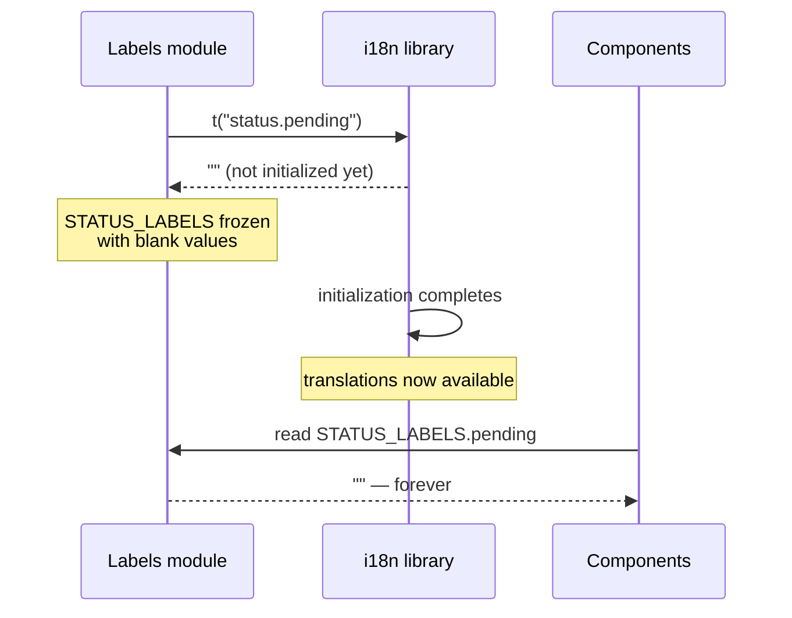
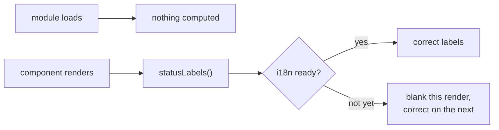

**TL;DR**

- A module built a shared object of translated labels once, at import time, by calling the translation library immediately.
- The library initialized asynchronously and wasn't ready yet — so every label resolved to blank at the moment the constant was computed.
- Because the object was computed exactly once and reused everywhere as a frozen constant, it stayed blank for the module's entire lifetime, long after the library became ready.

Computing a value once at module load is normally the responsible choice. It avoids redundant work for something that looks like it can't change:

```ts
// Runs at import time. Exactly once.
export const STATUS_LABELS = {
  pending:  t("status.pending"),
  approved: t("status.approved"),
  rejected: t("status.rejected"),
};
```

The assumption baked in there is that `t()` is ready to answer by the time this module is imported. It wasn't.

## Why the failure was permanent, not transient



If the labels had been recomputed on each use, this would have been a brief, self-correcting glitch: blanks for a moment during startup, correct text once the library caught up.

| | Recomputed per call | Frozen at module load |
| :--- | :--- | :--- |
| During init window | blank | blank |
| After init completes | correct | **still blank** |
| Self-corrects | yes | never |
| Depends on import order | no | yes |

The bug wasn't the race. Races that resolve on their own are common and usually harmless. It was combining a race with a cache that never expires.

## Why it wasn't isolated to one file

The same pattern had been copied into several unrelated files, because it reads as the obvious, idiomatic way to define a set of constant labels. Each copy carried the same latent bug, and each surfaced or didn't depending on module load order — which nobody reasons about when writing a labels file.

## The fix

Expose the labels as functions, evaluated per call:

```ts
// Asked fresh each time. Load order stops mattering.
export const statusLabels = () => ({
  pending:  t("status.pending"),
  approved: t("status.approved"),
  rejected: t("status.rejected"),
});
```



That trades a small amount of repeated work for correctness that doesn't depend on load order.

## The transferable part

"Compute once at module load" is only safe for values actually available and correct at load time — and asynchronous initialization anywhere in the dependency chain breaks that quietly, without raising anything.

If a value depends on something that initializes asynchronously, treat it as a function to call rather than a constant to freeze. The cost of recomputing is almost always smaller than the cost of caching a value from before its dependency was ready — especially when the cached value is an empty string, which looks like a styling bug rather than a lifecycle one.
