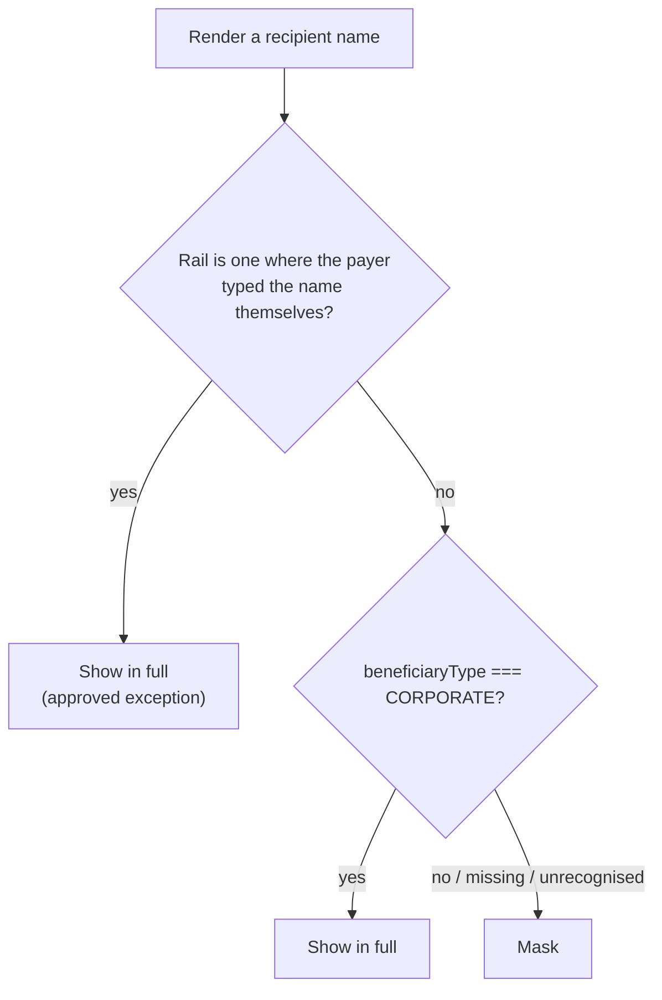

**TL;DR**

- A masking rule needs a branch for "we can't tell whether this recipient is a person or a company" — and that branch is the whole design.
- The original ruling was to show the name. I reversed it: over-masking is loud and harmless, under-masking is silent and harmful.
- Writing it as an allowlist (`=== CORPORATE`) rather than a denylist sends every unknown toward masked, including unknowns nobody has invented yet.

A payments product shows you who you paid. That sounds like a rendering problem and it isn't.

If the recipient is a company, showing the full name is the point — you want to see *Acme Pte Ltd* in your transaction history, not asterisks. If the recipient is a person, their name is somebody else's personal data, and it appears on screens that get shared, screenshotted, and screen-shared during support calls. So the rule is simple to state: **mask individuals, show companies.**

The rule is trivial. What matters is the branch nobody writes on purpose: what happens when you can't tell which one it is.

## The setup

The frontend can't classify a recipient by itself. Whether a payee is an individual or a corporate account is a property of the account record, and the ID format that encodes it is an internal convention, not a public contract — parsing it in the client would be building on sand. So the backend exposes a discriminator alongside the name, and the UI branches on it.

Which gives you three cases, not two:

```ts
type BeneficiaryType = typeof INDIVIDUAL | typeof CORPORATE | undefined;
```

`undefined` isn't a hypothetical. It shows up constantly:

- the field is genuinely inapplicable — for a plain bank transfer there is no platform account behind the name at all
- the record predates the field, so it comes back null
- one endpoint out of a dozen hasn't been updated to populate it yet

That last one is the interesting one, and I'll come back to it.

## The original ruling was fail-open

The design draft resolved the unknown case toward **showing the name**. The reasoning was reasonable: masking here is a privacy convenience rather than a hard security boundary, and mangling a corporate name into `Ac******td` is a visible, annoying defect. Better to over-show than to over-hide.

I reversed it during implementation. The reversal is worth writing down precisely because it leaves no trace — there is no diff that says "we chose the other default." It survives as one branch in one helper, and the next person to read that helper will find it obvious in whichever direction it happens to point.

## The asymmetry

Both defaults fail. They do not fail comparably.

**Fail-open, when the field doesn't resolve:** a real person's name renders in the clear. Nothing throws. Nothing logs. The screen looks exactly like a screen that's working. To catch it in review you would have to already know that this particular recipient was an individual and that the discriminator hadn't loaded — which means you'd have to be looking for the bug to see the bug. It can sit in production indefinitely.

**Fail-closed, when the field doesn't resolve:** a corporate name renders as asterisks. Someone notices within minutes. It gets reported as "why is this masked?" and lands in a ticket.

That's the whole argument. One failure mode is silent and harmful. The other is loud and harmless. When you can't have neither, take the loud one.

The corollary is that fail-closed doesn't make you correct — it makes you *wrong in a direction that generates its own bug report*. Over-masking is a defect. It's a defect that fixes itself, because the system complains about it.

## What made it decisive

The abstract argument is easy to wave away. The concrete one wasn't.

At the time of the decision, several surfaces had no backend support for the discriminator at all — the recipient search path, the add-recipient flow, an ID-lookup validation step. Not "sometimes null." Always null.

Under fail-open, those surfaces would have shipped masking *nothing*. And they're precisely the surfaces most likely to stay that way: nobody is going to notice a screen that quietly declines to mask.

Under fail-closed, the same backlog becomes visible over-masking. The debt gets a face. Someone will chase it because someone will complain about it.

That reframes the choice. It isn't "which default is more correct in theory," it's **which default converts incomplete rollout into something a human will act on.**

## The rule

Two gates, evaluated outside-in.



The inner gate is four lines and the shape of it is the point:

```ts
export function maskUnlessCorporate(
  name: string,
  beneficiaryType: number | undefined,
): string {
  return beneficiaryType === CORPORATE ? name : maskIndividualName(name);
}
```

It is an **allowlist**, not a denylist. `=== CORPORATE`, never `!== INDIVIDUAL`.

Those two look interchangeable and are not. `!== INDIVIDUAL` unmasks `undefined`. It unmasks `null`. It unmasks a value some future migration introduces, and a string `"2"` that arrived where a number `2` was expected. Every unknown resolves toward disclosure. The allowlist form sends every unknown the other way, and that includes unknowns nobody has invented yet.

This is the kind of line a well-meaning cleanup pass "simplifies" later, so it's worth a comment saying don't.

### The exception layer

The outer gate exists because a pure type-check would have been unusable. On rails where the recipient is a beneficiary the payer entered into their own address book — a bank transfer, a domestic instant-payment transfer — the backend correctly returns no type, because there's no platform account to classify. Pure fail-closed would mask every bank recipient in the product, including the ones the user typed themselves five seconds earlier.

The important detail is what the exception keys on. It keys on **the rail**, not on the null.

"Null on this rail is expected and the name is the payer's own data" is a claim about a specific, enumerated set of payment rails. "Null means it's fine to show" is a claim about the absence of information. The first is a whitelist you can audit; the second is fail-open wearing a hat.

## Testing a default

Most of the test file is unremarkable — corporate shows, individual masks. One case earns its place:

```ts
it("fails closed for any non-CORPORATE value, not just INDIVIDUAL", () => {
  expect(maskUnlessCorporate("Jonathan Smith", 999)).toBe("Jo******th");
});
```

`999` isn't a real value. It can't be produced by the system. It exists to pin the *semantics* of the gate rather than its behaviour on valid input — and it is the only test that fails if someone later rewrites the condition as `!== INDIVIDUAL`.

That's a property test wearing an example test's clothes: the property is "unrecognised input masks," and the example is one arbitrary witness.

Two things it does not do, which I'd rather say than let you assume:

- it's example-based, so it pins the values I thought of, not the property over all inputs
- there's a case for `undefined` but not `null`, which is exactly the kind of gap this style of test is bad at surfacing

## The masking itself

Small, but two decisions inside it are non-obvious.

```
"Jonathan Smith"  →  "Jo******th"
"Li"              →  "L******"
""                →  ""
```

Names of four characters or fewer get first-character-plus-asterisks instead of first-two-plus-last-two, because on a short name the general form reveals the entire string. `Anna` under the standard rule is `An******na` — which is `Anna`, with decoration.

And the asterisk run is **fixed at six**, not proportional to the name's length. A proportional mask leaks length, and length plus context is often enough. Masking is not a place to be helpfully informative about what you're hiding.

Neither of these is handled well for non-Latin scripts — the slicing is code-unit based, so anything outside the basic plane splits incorrectly. That's a known gap, not a solved problem.

## It worked, and the proof was a bug

One of the surfaces renders names inside a table with hidden columns, and hidden column values arrive as strings. So `"2" === 2` was false, and every corporate name on that screen masked.

That's a real defect and it was reported within a day. It's also the thesis demonstrated in production: a type coercion bug on the discriminator degraded into *over-masking*, not into a leak. The same bug under `!== INDIVIDUAL` would have unmasked individuals instead, and would still be there, because nothing about a correctly-rendered name looks wrong.

I've stopped thinking of that as a lucky outcome. Choosing a default *is* choosing which of your future bugs are loud.

## The part that isn't solved

The invariant — every surface that renders a recipient name routes through this helper — is enforced by one shared export and the fact that people remember to use it. Eleven call sites across ten files, all correct today, none of them structurally prevented from being wrong tomorrow.

No lint rule forbids rendering a raw name field. No wrapper component makes the safe path the only path. A new screen that reads the name straight off the response and drops it into a cell is caught by nothing — not a test, not a type, not review unless the reviewer happens to know.

The right fix is a type-level one: make the raw name unrenderable — a branded type that only the masking function can unwrap — so forgetting is a compile error instead of a privacy incident. That isn't built yet.

Which is its own version of the same lesson. The default direction was the cheap decision and it bought most of the safety. The structural enforcement is the expensive one, and until it exists, "we all remember" is doing load-bearing work.

---

*This describes a design pattern from production work on a payments platform. All identifiers, rails and code shown here are generic reconstructions of the idea, not the original implementation.*
