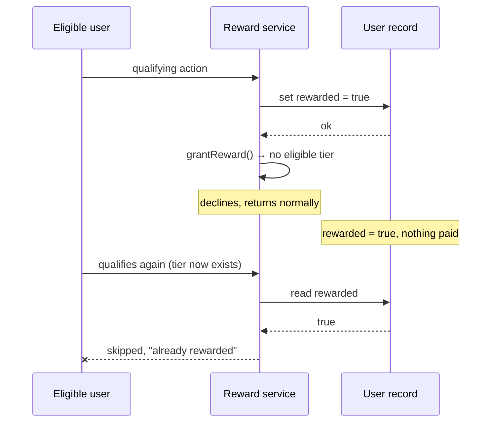
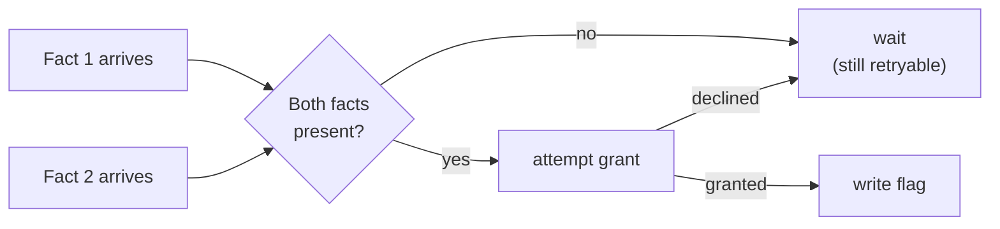

**TL;DR**

- A referral-style reward system wrote a "reward granted" flag, then attempted the grant. That ordering assumed the grant would succeed.
- It didn't always succeed — a legitimate case existed where there was no eligible tier to grant against — and when it declined, the flag was already permanently set.
- The entity was now marked "rewarded forever" with no reward ever paid, and no future eligible attempt could retry, because the flag itself was the only thing gating retries.

The bug wasn't a race condition and it wasn't a crash. It was an ordering assumption baked into two lines:

```ts
await markRewarded(userId);        // record the outcome
await grantReferralReward(userId); // …then produce it
```

Read quickly, those two lines look like they belong in either order. They don't. The first line is a claim about something the second line hasn't done yet.

## The case that broke it

The grant could legitimately decline — not from an error, but from a real business rule: no eligible offer tier existed for that entity at that moment. A decline is a valid outcome, not a bug. The bug was entirely in what happened *around* the decline.



Nothing downstream could tell the difference between "rewarded and paid" and "marked rewarded, paid nothing." Both look identical in the data.

| | Genuinely rewarded | Declined, then flagged |
| :--- | :--- | :--- |
| `rewarded` column | `true` | `true` |
| Payout record | exists | none |
| Error logged | — | none |
| Future attempts | correctly skipped | **wrongly** skipped, forever |

Because the flag was *also* the retry gate, a single declined attempt closed the door on every future attempt — including ones that would have been eligible.

## Why nobody noticed immediately

This isn't a failure mode that throws. The write succeeded, the decline was a normal return value, and the system moved on. The only visible symptom was a report, much later, that eligible users weren't receiving rewards they should have qualified for — a business observation, not an engineering alert.

## The fix

Two changes, not one.

**Reorder**, so the flag records an outcome rather than predicting one:

```ts
const result = await grantReferralReward(userId);
if (result.granted) {
  await markRewarded(userId);   // only now is it true
}
// declined → nothing written → still retryable
```

**Generalise the trigger**, so the flag fires off whichever of the two required facts lands second, rather than being written speculatively ahead of either:



The two facts could arrive in either sequence depending on the caller, so keying off "whichever lands second" closes the same class of bug for the other ordering too.

## The transferable part

A completion flag is a promise about something that already happened. The moment it gets written before the thing it describes, it stops being a record and becomes a guess — and a guess that also gates retries turns one declined attempt into a permanent lockout.

If a flag both records success and blocks future attempts, write it only after the outcome it claims to describe is actually known. And be suspicious of any decline path that returns normally: those are the ones that quietly walk past everything you built to catch failures.
