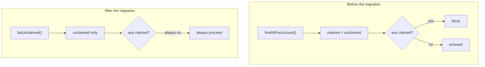

**TL;DR**

- A guard checking "is this record already claimed?" was carried over unchanged during a service migration.
- The data source it read from was rewired, in the same migration, to a list defined — by construction — to only ever contain unclaimed records.
- The guard still ran on every request. It could never return true again, because the set it checked structurally excluded the case it existed to catch.

Nothing about this looked like a regression. The guard's code was untouched:

```ts
// Unchanged before and after the migration.
const alreadyClaimed = candidates.some((r) => r.id === recordId && r.claimed);
if (alreadyClaimed) throw new ConflictError("already claimed");
```

Its tests still passed, because they exercised the check's logic against hand-built fixtures rather than the real data path. The migration passed review, because reviewers were checking whether the guard's *code* moved correctly — which it did.

## Where the actual break was

One layer away, in the definition of the list being searched:

```ts
// Before: could contain both states.
const candidates = await repo.findAllForAccount(accountId);

// After: the new service's equivalent, which pre-filters.
const candidates = await service.listUnclaimed(accountId);
```

`listUnclaimed` was a perfectly reasonable API for the new service's own purposes. But `r.claimed` is now `false` for every element it returns, so `alreadyClaimed` is `false` by construction.



The guard didn't start returning *wrong* answers. It started returning the *same* answer, always.

## Why it took weeks to notice

A guard that silently stops catching things produces no symptom of its own. It produces the absence of a symptom that used to occasionally appear.

| | A guard that breaks loudly | A guard that goes tautological |
| :--- | :--- | :--- |
| Throws | yes | no |
| Test failure | likely | none — logic is still correct |
| Compiler help | sometimes | none |
| Observable signal | error rate rises | block rate silently drops to zero |
| Time to detection | minutes | weeks |

Nothing alerts on "this check hasn't blocked anything in three weeks" unless someone is watching that metric — and nobody was, because it was a low-frequency safety net rather than a hot path worth dashboarding.

## The fix

Restoring a data source that can actually represent the "claimed" state was the direct fix. The durable part was a test that drives the guard through the **real** data path with a genuinely claimed record:

```ts
it("rejects a record already claimed by someone else", async () => {
  await claimRecord(recordId, otherAccountId);   // real state, real path
  await expect(claim(recordId, accountId))
    .rejects.toThrow(ConflictError);
});
```

The old tests asserted that the predicate works. This one asserts that the predicate is still *reachable* — so a future rewiring of the upstream list fails the test instead of passing it silently.

## The transferable part

"The guard's code is correct" and "the guard's input can still trigger it" are two separate properties, and a refactor can preserve the first while quietly destroying the second.

Whenever an upstream data source changes what it's capable of containing, ask whether any downstream check depends on it containing the case that check exists to catch. A check that structurally can't fail anymore will never tell you so — and a test built on fixtures rather than the real path will keep agreeing with it.
