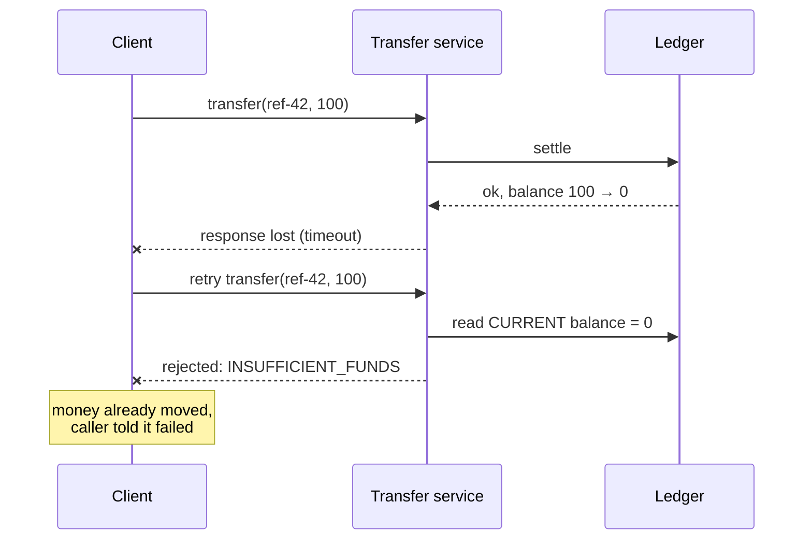
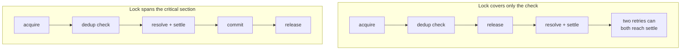

**TL;DR**

- A transfer system needed to decide whether a retried request was "the same" as one already processed.
- The instinct — re-check the request against *current* recipient and balance state — is wrong, because a retry of an already-successful transfer can look ineligible against state its own first attempt changed.
- The fix keyed idempotency off the request's immutable inputs as of submission time, and separately widened the exclusivity lock to span the whole resolve-and-settle window rather than just the dedup check.

The obvious way to check "have we already done this?" is to re-run the eligibility logic against current state and see whether the answer is still yes:

```kotlin
// Tempting, and wrong for a retry.
val recipient = resolveRecipient(req.recipientId)      // current state
if (!recipient.isEligible()) reject(INELIGIBLE)
if (balanceOf(req.sender) < req.amount) reject(INSUFFICIENT)
```

For a transfer, that's backwards in one specific case: the first successful attempt *changes* the balance, and possibly the recipient's eligibility for further transfers, as a direct consequence of succeeding.

## The failure this avoids



Rejecting the retry as ineligible is worse than either accepting it or correctly deduplicating it: it tells the caller something failed when in fact their money already moved.

| Retry evaluated against… | Duplicate correctly detected? | Risk |
| :--- | :--- | :--- |
| Current balance / eligibility | no — state already moved | reports failure for a completed transfer |
| Submission-time immutable inputs | yes | none for this case |

## Why the fix keys off submission-time inputs

The transfer's immutable inputs — sender, recipient, amount, client reference — describe *what was requested*, independent of how the world has changed since:

```kotlin
// Idempotency decided before any current-state resolution.
val fingerprint = Fingerprint(req.senderId, req.recipientId, req.amount, req.clientRef)

existingByFingerprint(fingerprint)?.let { prior ->
    return prior.result          // replay the original outcome, don't re-judge
}

// Only now does current state matter — for doing the work, not for dedup.
val recipient = resolveRecipient(req.recipientId)
```

Current state is still used for the actual transfer logic. It's just no longer part of the *duplicate-detection* decision.

## The lock has to cover the whole window

A related fix: the exclusivity lock preventing two concurrent attempts must be held from before the transactional boundary through the entire resolve-and-settle sequence — not released after the dedup check and re-acquired later.



## The transferable part

Idempotency logic that reads current state to answer "have I seen this before?" is vulnerable whenever the operation being deduplicated is the thing that changes the state it's checked against. That's most of them, in a payments system.

The safer design evaluates duplicate-ness against the request's own fixed inputs and replays the recorded outcome, treating current state as relevant only to performing the operation — never to deciding whether it already happened.
