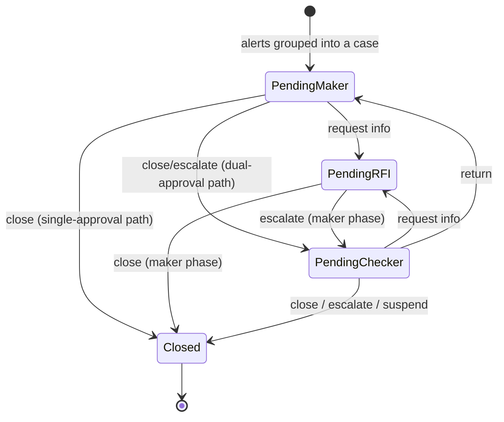

**TL;DR**

- One shared "awaiting information" status can be entered by either role, so the status alone can't say whose turn it is.
- "The checker returned this case" is not stored anywhere and has to be reconstructed from the audit log — five load-bearing assumptions to answer one boolean.
- Role separation (scopes) and actor separation (this human ≠ that human) are different controls. Decide explicitly which one you are building, and where it is enforced.

Four-eyes review is an old idea: one person investigates and proposes, a second independently approves. Regulated workflows are full of it. Building the UI for one taught me that the hard part isn't the happy path — it's that the state model you're handed is almost always slightly too small to answer the questions the UI needs to ask.

The domain: transaction-monitoring alerts get grouped into cases. A **maker** investigates a case and proposes an outcome. Depending on how the case scores, that either closes it or escalates it to a **checker**, who independently decides. Either role can pause and request more information.

## The state machine

Four statuses, and the transitions between them are almost all conditional.



Two things in that diagram are doing more work than they look like they are.

**The same outcome leads to different states.** A maker choosing "close" closes the case on a single-approval path and sends it to a checker on a dual-approval path. Which path a case is on is assigned up front from its risk score. So the button can't be labelled from the outcome alone — it has to read "Submit & Send to Checker" or "Close Case" depending on the path, or the maker will believe they've finished something they've only started.

**`PendingChecker → PendingMaker` clears the outcome.** A checker who returns a case sends it back for more work, and the backend nulls the stored outcome because the proposal is no longer live. That's defensible and it destroys information the UI needs. More on this below.

## The status that can't tell you whose turn it is

There is one `PendingRFI` status, and both roles can enter it. A maker pauses to request information; so does a checker. Same status either way, and the stored outcome is overwritten to "RFI" in both cases.

So given a case sitting in `PendingRFI`, the status tells you nothing about who acts next.

The UI resolves it by comparing decision timestamps — whoever decided most recently is the one whose phase we're in:

```ts
const checkerActive = (history) =>
  (history.checkerDecision?.timestamp ?? "") >= (history.makerDecision?.timestamp ?? "");
```

This works. It works because the timestamps are fixed-width formatted strings, so lexicographic comparison happens to order them correctly. I want to be honest that this is a **weak** solution and I'd argue for changing the schema rather than defending it:

- string comparison of timestamps is correct only by the accident of the format
- resolution is to the minute, so two decisions in the same minute are indistinguishable
- ties resolve to the checker, which is a coin flip dressed as a rule
- no timezone is carried

The correct fix is a field. `rfi_raised_by_role`, or splitting the status into two. Deriving "whose turn is it" from timestamp ordering is inferring a fact the system knows and chose not to write down.

The guard against RFI ping-pong is nicer: the set of allowed outcomes **shrinks on re-entry**. A case in the maker's RFI phase can only close or escalate — it cannot raise another RFI. A case in the checker's RFI phase can close, escalate, or suspend, but not RFI and not return. One RFI per phase, enforced by the transition table rather than by a counter. (Return has no equivalent cap, so checker→return→maker→escalate→checker can still cycle indefinitely. That's a real gap.)

## A decision the backend doesn't store

The hardest bug in this feature was this: **"the checker returned this case" is not a stored fact.**

On return, the backend sets status to `PendingMaker` and clears the outcome. Both of those are individually reasonable — the case *is* pending the maker, and the outcome *isn't* live. But a case in `PendingMaker` with no outcome is indistinguishable from a brand-new case that has never been looked at.

The maker needs to know. They need to see the checker's reason for returning, and to resume from their own previous proposal rather than starting over.

The only durable trace is the audit timeline, so the state gets reconstructed from it:

```ts
const latestReturn = timeline
  .filter((e) => e.eventType === "CHECKER_DECIDED" && e.details.outcome === "RETURN")
  .reduce(latestByTimestamp, null);

const isReturned =
  status === "PENDING_MAKER" && latestReturn !== null && checkerActive(history);
```

It works, and I'd flag every assumption it rests on:

- the audit log is complete and retained for as long as cases live
- the client has paginated *all* of it, not just the recent page
- timestamps are string-comparable
- `details.outcome` is serialised consistently — and it isn't fully, since the same field arrives as a numeric ordinal, an enum code, or a human-readable label depending on which endpoint produced it, so the normalisation layer has to accept all three
- no future event type ever reuses that details shape

That's five load-bearing assumptions to answer a yes/no question. The right fix is one nullable column recording that the case was returned. Deriving state from an audit log is a legitimate technique — it's how event sourcing works — but it's only sound when the log is *designed* as the source of truth. Deriving from a log that exists for compliance reporting means depending on a contract nobody wrote for you, and that can change without anyone thinking they've broken anything.

The tell that you're in this situation: you're filtering an audit trail by event type in a component that renders a button.

## Roles are not people

A design question this workflow forced me to think carefully about, and one I'd now raise early in any four-eyes build.

The natural way to gate a two-role workflow in a UI is by **scope** — you need the maker scope to act at the maker step, the checker scope to act at the checker step:

```ts
const canAct =
  hasScope("case") && hasScope(step === "CHECKER" ? "case.checker" : "case.maker");
```

That's the right shape for the UI layer. A maker-only user viewing a case awaiting a checker sees a read-only "awaiting checker review" panel; a checker-only user sees the mirror image. The two roles cannot do each other's work, and the interface stops presenting actions nobody can take.

But notice what scope-based gating expresses and what it doesn't. It expresses *this account has the checker capability*. Four-eyes is a claim about **people**: the human who proposed is not the human who approved. Those coincide exactly when scope assignment is disjoint in practice — a policy fact about how accounts are administered, living entirely outside the code.

So there are two separable controls hiding under one word:

1. **Role separation** — enforced by scopes, visible in the UI, easy to test.
2. **Actor separation** — the acting principal differs from the recorded actor of the prior decision. That one is a comparison against the audit record, it belongs server-side at the decision endpoint, and no amount of UI gating substitutes for it.

The lesson I took: decide explicitly which of those two you're building, and write down where each is enforced. If actor separation is guaranteed by administration rather than by code, that's a legitimate design — segregating scopes at the identity provider is a real control — but it should be a decision someone made and recorded, not a property everyone assumes the scope check is already providing.

The failure mode isn't a bug you can point at. It's a room full of people who each believe a different layer is doing the check.

## Locking the maker's work

One thing I think is right, and it's a one-line idea.

When a case moves to the checker, the maker's notes, attachments and checklist freeze. The checker sees precisely what the maker submitted; a checker who disagrees must *return* the case rather than edit it, so the audit trail keeps proposal and revision separate.

The implementation detail that makes it hold:

```ts
const notesEditable = !locked && getDecisionConfig(detail).canAct;
```

Editability is derived from **the same predicate** as the ability to decide, rather than being its own parallel condition. Two conditions that must always agree, expressed once. The alternative — an independent `canEditNotes` check — is the sort of thing that stays correct for a year and then drifts when someone adds a status and updates one of the two.

That's the general shape worth stealing: when two permissions must move together, don't write them twice.

## What I'd change

The problems above share a root cause. A status column answers "what state is this case in." A review UI needs to answer "whose turn is it, what happened last, and which layer guarantees the separation we're claiming." Those are different questions, and where the schema doesn't answer them, the gap gets filled by inference — timestamp comparison, audit-log archaeology, a capability check standing in for an identity rule.

Inference works. It also depends on things nobody promised. The fix in each case is boring and structural: write the fact down. A role field on the RFI. A returned-at column. An explicit note on where actor separation is enforced.

Inference is what you do when the schema is missing a column. It's worth noticing that's what you're doing, rather than getting good at it.

---

*This describes a design pattern from production work on a compliance operations console. All identifiers, statuses and code shown here are generic reconstructions of the idea, not the original implementation.*
