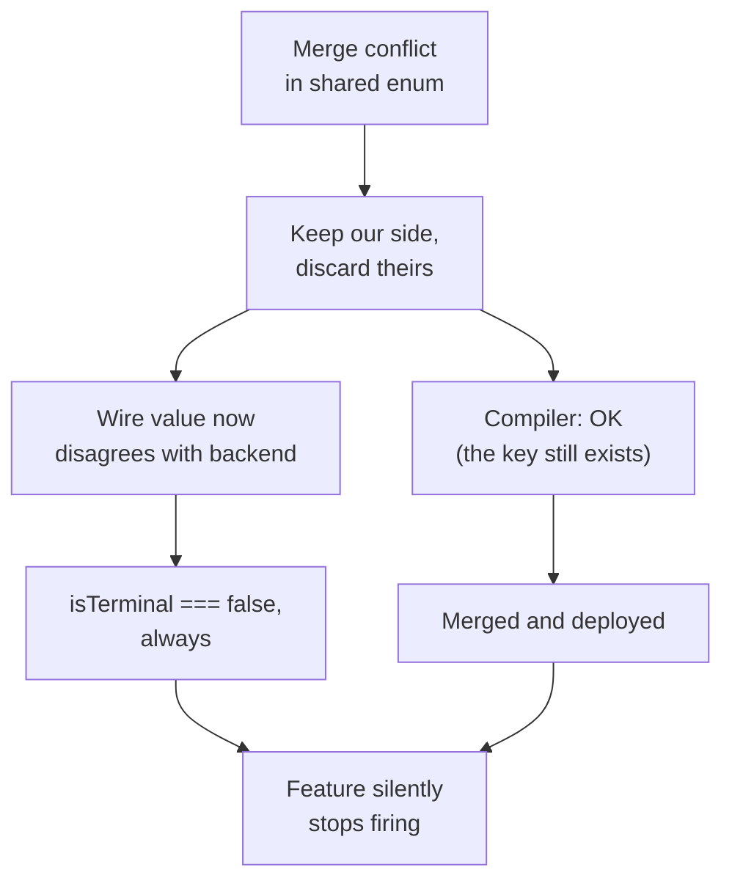

**TL;DR**

- Two long-running branches independently assigned different meanings to the same numeric enum keys. The merge conflict looked cosmetic — a couple of lines in one file — and got resolved by keeping "our" branch's values.
- The discarded side's values weren't dead code. They matched a backend contract that had already shipped, and other, already-merged code referenced them by number.
- The break didn't show up as a merge failure or a compile error. It showed up as a boolean check that quietly always evaluated false, because the value it was comparing against no longer existed.

The conflict itself was small enough to resolve in under a minute. Git flagged a handful of overlapping lines in a shared enum, the fix looked obvious — pick a side, keep it consistent — and the merge went through clean.

```ts
<<<<<<< HEAD
  ESCALATED = 4,
  ARCHIVED  = 5,
=======
  ARCHIVED  = 4,
  SUSPENDED = 5,
>>>>>>> feature/other-branch
```

Two people adding constants to the same enum. That's what it looks like. What it *is* is two people assigning different real-world meanings to the same wire values — and only one of those assignments matches what the backend already shipped.

## Why "pick a side" was the wrong question

The real question wasn't which branch's enum was nicer or more recently written. It was which branch's *numbers* other code already depended on — an empirically checkable fact, not a style preference.

| The question asked | The question that mattered |
| :--- | :--- |
| Which naming reads better? | Which numbering matches the shipped API contract? |
| Which branch is newer? | Which values have live references outside this file? |
| Can I keep mine? | What breaks if I delete theirs? |
| Does it compile? | Does anything still resolve to the *wrong* value? |

Nobody ran the second column, because the conflict didn't look like the kind that needed it.

## How it failed silently

The discarded keys had already been referenced by code merged earlier, in a different file, for a different feature:

```ts
// Merged weeks ago. Untouched by this merge. Still compiles.
const isTerminal = status === CaseStatus.ARCHIVED;
```

`CaseStatus.ARCHIVED` still exists after the merge, so TypeScript is satisfied. It just points at `4` now instead of `5`. The comparison no longer matches the value the backend actually sends, so `isTerminal` is permanently false.



No exception, no log line, no test failure. The feature behind that boolean just stopped happening, and nothing about the deployment looked wrong.

## The fix

Restoring the discarded keys wasn't enough on its own — the two branches also had to agree with the contract they were both supposed to be implementing, not merely with each other. The resolution became:

1. **Look up the authority.** The API contract already defined these values. That's the tiebreaker, not branch age or author.
2. **Reconcile the enum to it**, renaming where the two branches had picked different names for the same value.
3. **Grep the whole codebase** for every reference to the enum — not just the conflicted file — to find the already-merged code that had been silently repointed.

Step 3 is the one that would have caught it before the merge, and it costs about thirty seconds.

## The transferable part

An enum or ID conflict that "compiles either way" is not actually ambiguous — it just looks ambiguous at the diff level. The moment two branches assign different meanings to the same identifier, the question "which one is real" almost always has a factual answer sitting in a contract, a database, or another team's already-shipped code.

Resolve conflicts like that by checking what depends on the value, not by picking whichever side is easier to keep. The compiler will not help you here: renumbering a constant is invisible to it, and the code that breaks is the code nobody edited.
