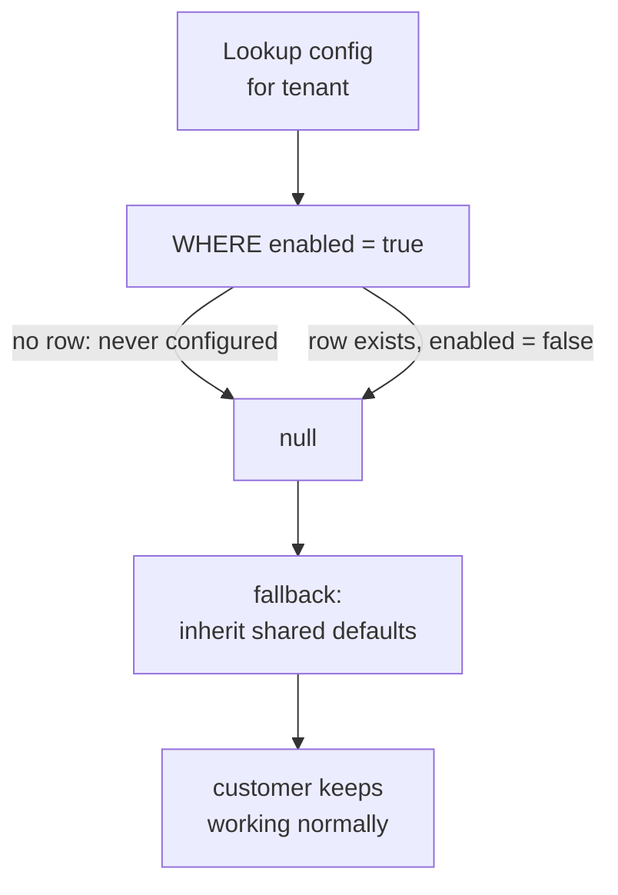
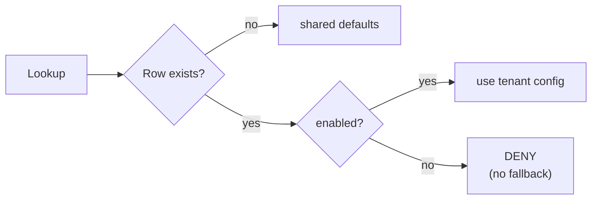

**TL;DR**

- A per-tenant configuration lookup had a fallback: if no row was found, inherit a shared default from elsewhere.
- The lookup couldn't distinguish "no row exists because nobody configured this tenant yet" from "a row exists and explicitly says disabled" — both returned an empty result to the caller.
- An operator disabling a customer's access in the back office had no real-world effect: "disabled" collapsed into the same empty result as "not configured," and the fallback kicked in either way.

The fallback existed for a good reason. Most tenants don't need bespoke configuration, and requiring an explicit row for every tenant just to get sensible defaults would have been needless setup work. The bug wasn't the fallback — it was that the fallback's trigger condition was true for two states needing opposite behaviour.

```ts
const config = await repo.findEnabledConfig(tenantId);
if (!config) {
  return sharedDefaults;   // "not configured" AND "disabled" both land here
}
return config;
```

`findEnabledConfig` filters on `enabled = true`. A row that exists and says `enabled = false` returns nothing — indistinguishable, at the call site, from no row at all.

## Two different kinds of nothing

| | "Never configured" | "Explicitly disabled" |
| :--- | :--- | :--- |
| Row in table | absent | present, `enabled = false` |
| What the lookup returns | `null` | `null` |
| What it should mean | inherit defaults | **deny** |
| What actually happened | inherit defaults | inherit defaults |

Both are, at the data layer, an absence of an *enabled* row. To the business they mean opposite things: the first should inherit sensible defaults, the second is a deliberate decision that must not be quietly undone by a fallback the operator has no reason to know exists.

Once that distinction doesn't exist in the returned value, no amount of care in the calling code can recover it. The information is already gone by the time the fallback runs.



## What it looked like operationally

An operator used the back office to disable a customer's access — a normal compliance or risk action. The save succeeded. The audit log recorded it. The customer kept working exactly as before.

There was no error, no failed write, nothing suggesting the action hadn't taken effect. It *had* taken effect. The read path just couldn't see it.

## The fix

Make the lookup return three outcomes instead of two, and only fall through on the one that genuinely means "no decision has been made":

```ts
const row = await repo.findConfig(tenantId);   // no enabled filter

if (row === null)      return sharedDefaults;  // genuinely unconfigured
if (row.enabled === false) return DENY;        // explicit, authoritative
return row;
```



The rule that came out of it: **no fallback once a lookup resolves to a value that means something on its own.** A fallback is for the absence of a decision, never for a decision you'd rather not honour.

## The transferable part

A fallback triggered by "empty result" is only as safe as your certainty that every path producing an empty result means the same thing. The moment "disabled" and "not configured" can both look empty at the read layer, an operator action meant to be authoritative can be silently overridden by logic written for a completely different, more benign case.

If a state needs to be respected, it needs to be representable. "Empty" is rarely specific enough to carry that weight — and the filter in your query (`WHERE enabled = true`) is often the exact place the distinction gets thrown away.
