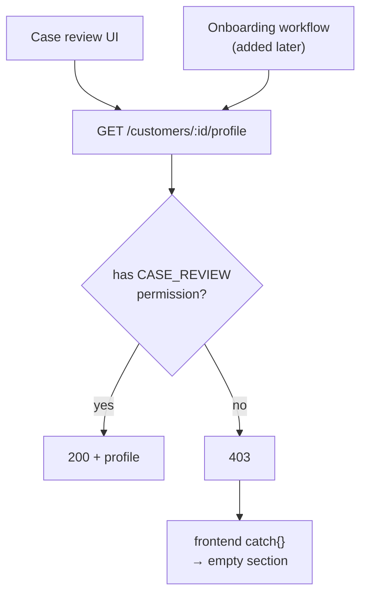

**TL;DR**

- A read endpoint checked the caller's permission for the specific module it was originally built to serve.
- Months later, an unrelated workflow started calling the same endpoint for incidental data it happened to need.
- Users with the right permission for the new workflow, but not the old module's, got silently rejected — and the frontend swallowed the failure into an empty section instead of surfacing an error.

The authorization check wasn't wrong when it was written:

```kotlin
@RequiresPermission(Module.CASE_REVIEW, Action.READ)
@GetMapping("/customers/{id}/profile")
fun getProfile(@PathVariable id: Long): ProfileResp
```

It correctly gated a module's data, for a caller who was, at the time, always coming from that module. The bug was a decision never revisited: the endpoint's authorization was scoped to **who originally called it**, not to **what the data actually is** — and those stay equivalent only until a second caller shows up.

## How the second caller got trapped

Reusing the endpoint was the reasonable choice. It existed, it worked, it returned the right shape.



| | Original caller | Later caller |
| :--- | :--- | :--- |
| Why it needs the data | it *is* case review | incidental profile lookup |
| Permission its users hold | `CASE_REVIEW` | `ONBOARDING` |
| Permission the endpoint demands | `CASE_REVIEW` | `CASE_REVIEW` |
| Result | works | silent 403 |

A user could hold exactly the right permission for the new workflow and still get a 403, because the endpoint was asking a question — "do you belong to that *other* module?" — that had stopped being the right question the moment it acquired a second legitimate caller.

## Why it was hard to see

The frontend's error handling had been written for the original module, where a 403 meant something predictable. In the new workflow, the same 403 was caught and swallowed:

```ts
// Reasonable-looking: don't let one panel's failure break the page.
const profile = await fetchProfile(id).catch(() => null);
// 403 and "genuinely no data" are now the same thing on screen.
```

An authorization failure and a legitimate empty state looked identical to the affected user. No error message anywhere pointed at the actual cause.

## The fix

Two parts, because there were two defects:

1. **Re-scope the authorization to the data**, not to whichever module asked first — then update both callers to check against that data-level scope.

    ```kotlin
    @RequiresPermission(Resource.CUSTOMER_PROFILE, Action.READ)
    fun getProfile(@PathVariable id: Long): ProfileResp
    ```

2. **Stop swallowing 403 into an empty state.** "You can't see this" and "there's nothing here" are different facts, and a user who hits the first one deserves to know:

    ```ts
    const profile = await fetchProfile(id).catch((e) => {
      if (e.status === 403) throw new PermissionError();  // visible
      return null;                                        // genuinely empty
    });
    ```

## The transferable part

An authorization check written for one caller tends to encode that caller's identity into the check, even when the intent was to protect the data. The moment an endpoint gains a second legitimate caller, that encoding becomes a trap — not because the check is broken, but because it answers a question that no longer matches why the endpoint is being called.

Scope authorization to what's being protected, not to who happened to ask for it first. And treat a swallowed 403 as a bug in its own right: an access-control failure that renders as an empty box is a failure nobody will report accurately.
