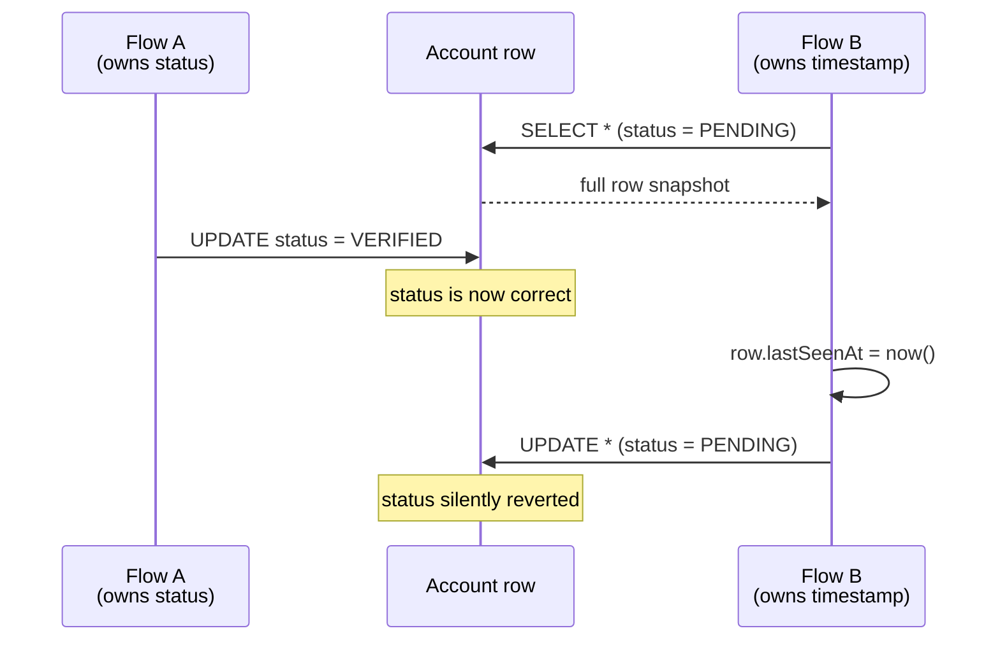
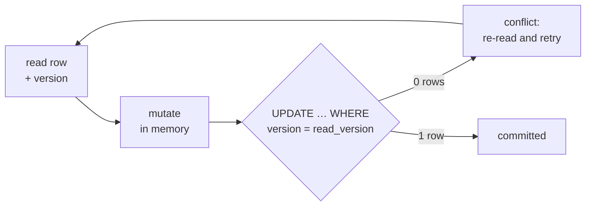

**TL;DR**

- One wide row held several independent status flags for the same account, each meant to be updated by a different, unrelated flow.
- A handler that only needed to bump a timestamp used a read-modify-write pattern: load the row, change the timestamp, save the whole row back.
- Its stale in-memory copy predated a different flow's single-column update. Saving the whole row back overwrote that column with the stale value — silently reverting a change nobody was touching.

This isn't the concurrency bug people picture when they hear "race condition." No thread interleaved mid-instruction, nothing needed to happen within microseconds of anything else. It only needed two things to happen out of order at the granularity of ordinary request handling.



Nothing in that sequence is fast. Flow B's read and its write can be seconds apart — the window is however long the handler takes, not a scheduler quantum.

## The shape of the mistake

The pattern is so ordinary it barely registers as a decision:

```ts
// Flow B only needs to bump one timestamp.
const account = await repo.findById(accountId);
account.lastSeenAt = Date.now();
await repo.save(account);          // writes EVERY column back
```

That last line is the bug. `save(account)` doesn't know Flow B only changed one field — it persists the whole object, including a `status` value that was already stale when it arrived in memory.

## Why a wide row makes this worse

A row with one column is safe under this pattern by accident — there's nothing else to revert. A row with many independently-owned columns turns every full-row read-modify-write into a bet that no other column changed between the read and the write. The wider the row, and the more flows that touch different columns of it, the more often that bet loses.

| | What the author intended | What the database received |
| :--- | :--- | :--- |
| Columns changed | 1 (`lastSeenAt`) | all of them |
| Values written | one fresh value | one fresh value + N stale ones |
| Conflict window | none, "it's just a timestamp" | read → write, however long that takes |
| Failure signal | — | none: the write succeeds |

Nobody designed the table to be unsafe. Each column was added by a different feature, at a different time, each assuming it was the only thing writing to "its" account's row that mattered for its own purpose. None of them were wrong about their own column. The row-level save is what turned "I changed my column" into "I overwrote every column with what I last saw."

## What it looked like in practice

An account got stuck mid-process: one flow had legitimately advanced its status column, and shortly after, an unrelated handler doing a routine timestamp bump loaded a copy of the row from before that advance and saved it back — quietly resetting the status to its previous value.

There was no error. The write succeeded, because it *was* a valid write. The account just sat there, looking like the first flow had never run, until someone traced it back through the row's update history.

## The fix

Two options exist for this class of bug, and the fix used the cheaper one — narrow the write to the column the handler actually owns:

```ts
// Flow B writes only what it changed.
await repo.updateLastSeenAt(accountId, Date.now());
// UPDATE account SET last_seen_at = $2 WHERE id = $1
```

That closes the specific bug without touching every other flow. The more general fix — optimistic locking with a version column checked on every full-row write — was noted as the right call if more flows end up needing whole-row semantics:



It wasn't needed here once the actual culprit turned out to be a handler doing more work than it had any reason to.

## The transferable part

"Load the object, change one field, save the object" is safe exactly as long as nothing else can touch the object in between — a guarantee that's easy to assume and expensive to verify. On a row with several independently-owned columns, the safer default is to update only the column you actually changed. Treat a full-row save as something you reach for deliberately, not as the default way to persist a one-field change.
