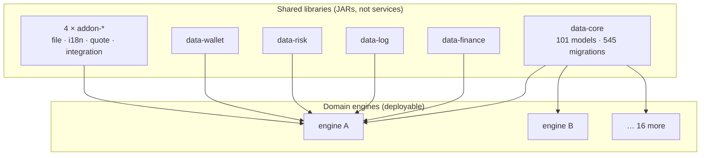

**TL;DR**

- A payments platform decomposed into ~50 repositories, including 18 deployable domain services. All of them depend on a shared data library that is not a service — it is a plain JAR holding the models, the query mappers, and **545 migration files**.
- This is database-per-service inverted. It buys one migration history and zero model drift across services that read the same tables. It costs lockstep deployment and turns one library version bump into a platform-wide event.
- The most interesting part isn't the pattern. It's the drift I found in the mechanism meant to hold it together: the shared parent build file that's supposed to align every service sits at **five different versions across six repositories**.

The received wisdom on service decomposition is close to unanimous: each service owns its data, nobody reaches into anybody else's tables, and if two services need the same information, one asks the other over the network. Database-per-service is the default, and sharing a schema is the anti-pattern with a name.

This platform does the opposite on purpose, and has for years. It's worth studying precisely *because* it violates the rule and still works — and because the specific ways it strains are not the ones the orthodoxy predicts.

## The shape of it

The repository taxonomy is enforced by naming, and it's legible at a glance:

| Prefix | Count | Role |
| :--- | :--- | :--- |
| `*-engine` | 18 | Deployable domain services — the business logic |
| `*-data-*` | 14 | Shared libraries: models, mappers, migrations |
| `*-api` | 8 | Edge / BFF layer in front of the engines |
| `*-addon-*` | 5 | Cross-cutting helpers (file, i18n, quoting, integrations) |
| `*-frontend` | 4 | Web surfaces |

The load-bearing one is the data layer. Here is the tell that it isn't a service:

```xml
<packaging>jar</packaging>
```

No application entry point, no server, no port. It's a dependency. And what it contains is substantial:

| Contents of the shared data library | Count |
| :--- | :--- |
| Domain models | 101 |
| Enums | 114 |
| Query mappers | 90 |
| Service classes | 93 |
| **Migration files** | **545** |

Those migrations split two ways — by dialect, and by kind:

```
db/migration/
├── postgresql/     156 files
│   ├── table/      schema DDL
│   └── data/       seed + reference data
└── mysql/          389 files
    ├── table/
    └── data/
```

The asymmetry is itself informative: 389 files of one dialect against 156 of another is the signature of a platform mid-migration between engines, carrying both histories at once.

## The dependency picture

A single domain engine declares **eleven** internal shared libraries — six from the data layer, four cross-cutting helpers, one common utility — plus the shared parent build file.



Every engine reads the same model classes, compiled from the same source, against the same schema. There is no serialisation boundary between them and the data definition.

## What this actually buys

It's easy to read the diagram as a mistake. It isn't, and the benefits are concrete.

**One migration history.** With 18 services against a shared schema, there is exactly one ordered sequence of DDL changes and one place to read it. The distributed alternative — 18 services each running their own migrations against their own stores, with cross-service consistency maintained by convention — is not obviously easier to reason about. It's just easier to *deploy*.

**Zero model drift.** When two services both need to understand what a transaction record is, they don't each define a DTO and hope the fields stay aligned. They import the same class. A field added to that class is visible to every consumer at compile time — which is the strongest form of contract propagation available, and it is strictly stronger than a versioned API schema that services adopt on their own timelines.

**Compile-time coupling is loud.** This is the underrated one. In a database-per-service world, a service that silently starts depending on another's data shape fails at runtime, in production, on an input nobody tested. Here it fails at build time. The coupling didn't disappear when teams split the services — it just became invisible. This architecture keeps it visible.

## What it costs

**Lockstep deployment.** A change to a shared model means recompiling and redeploying every service that imports it. There's no "roll out to one service first" — the blast radius of a data-layer change is the whole platform, by construction.

**The library becomes a queue.** Any team needing a schema change queues behind every other team's changes to the same library. With 18 consumers, the shared data library is the single busiest merge target on the platform, and its release cadence gates everyone.

**Dual-dialect authoring.** Every schema change must be written twice, correctly, in two SQL dialects — and verified against both. That's not a doubling of effort so much as a doubling of the *places a migration can be subtly wrong*.


## Where it actually strains — and it isn't where you'd guess

The orthodoxy predicts this architecture fails through *coupling*: teams blocked on each other, schema changes impossible to ship. That's not what I found. The coupling is real but managed — the release cadence absorbs it.

What I found instead is drift in the mechanism meant to hold the whole thing together. There's a shared parent build file that every service inherits from, whose entire purpose is to align dependency versions, compiler settings, and plugin configuration across the platform. Here's the version each repository pins:

| Repository | Shared parent version |
| :--- | :--- |
| Data library | `1.11.0` |
| Payment engine | `1.11.0` |
| Edge API (payments) | `1.13.0` |
| Edge API (wallet) | `1.13.0` |
| Open engine | `1.17.0` |
| Wallet engine | `1.0.0` |

Six repositories, **five different versions**, spanning `1.0.0` to `1.17.0`.

This is the part worth studying. The architecture chose tight coupling deliberately and accepted lockstep deployment as the price. But the alignment mechanism is *opt-in per repository* — each one names its own parent version — so in practice the platform gets the costs of tight coupling at the data layer and the drift of loose coupling at the build layer. The one service furthest behind is running a parent from before seventeen rounds of platform-wide dependency and plugin decisions.

The uncomfortable question this raises: if the point of sharing everything is consistency, and the mechanism for consistency is itself unversioned in practice, what is the coupling actually buying?

## The transferable part

"Shared database is an anti-pattern" is a rule that survives mostly because it's easy to state. The real tradeoff is narrower: sharing a schema converts *runtime* coupling into *compile-time* coupling. That's often a good trade — compile-time failures are cheaper than production ones — and the honest cost is deployment coordination, not correctness.

But a coupled architecture only pays off if the coupling is actually enforced. A shared parent that each repository pins independently isn't alignment, it's a suggestion, and it silently becomes the loosest link in a design whose entire premise is tightness.

If you're going to share, share on purpose and make the sharing mandatory. And if you find yourself with five versions of the thing that was supposed to make everything one version, that's not a minor hygiene issue — that's the architecture's central claim quietly failing to hold.
