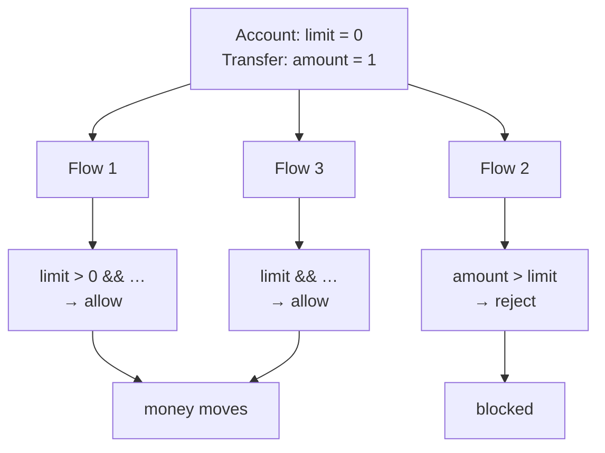

**TL;DR**

- A limit-check predicate — "does this amount exceed the configured limit?" — was implemented three separate times, in three separate places.
- All three agreed on the common case. They disagreed on the boundary: a configured limit of exactly zero meant "unlimited" in one and "blocked, always" in another.
- The disagreement only became visible when an account with a limit of zero got different outcomes depending on which code path handled the request.

Duplication like this rarely starts as a decision. Each copy was written by someone solving a real, immediate problem in the code they were touching, reasonably assuming a check this small didn't need to be shared infrastructure.

```ts
// Path A — zero means "no limit configured"
if (limit > 0 && amount > limit) reject();

// Path B — zero is a real limit
if (amount > limit) reject();

// Path C — zero means "no limit", written differently
if (limit && amount > limit) reject();
```

Three correct-looking implementations of the same rule. A and C agree by accident. B is the odd one out, and only for a single input value.

## Why zero was the fault line

| Configured limit | Path A | Path B | Path C |
| :--- | :--- | :--- | :--- |
| `1000`, amount `500` | allow | allow | allow |
| `1000`, amount `5000` | reject | reject | reject |
| `null` | allow | *crash / coerce* | allow |
| **`0`, amount `1`** | **allow** | **reject** | **allow** |

Zero is the value most likely to be special-cased by exactly one implementation, because it's genuinely ambiguous: "the limit is zero" can plausibly mean "nothing is allowed through" or "no limit was set, so don't restrict anything."

Both readings are defensible in isolation. Neither is obviously wrong until you need all copies to agree — at which point only one of them can be right for the system as a whole.

## What surfaced it

A bug report: an account with a configured limit of zero was blocked on one flow and allowed through on another, for what should have been the identical business rule.



Tracing the flows back showed they weren't sharing code at all — each ran its own from-scratch version, and had for long enough that nobody working on one knew the others existed.

## The fix

Consolidation to a single predicate, used by all three call sites:

```ts
/**
 * A configured limit of 0 blocks everything — it is treated as a real,
 * intentional restriction, not as "unset". Absence is `null`, not `0`.
 */
export function exceedsLimit(amount: Money, limit: Money | null): boolean {
  if (limit === null) return false;   // genuinely no limit configured
  return amount.gt(limit);            // 0 blocks everything, by design
}
```

The more consequential decision was *which* reading of zero to standardise on. For a money-movement flow the team deliberately chose the stricter one — a false block is a support ticket, a false allow is a loss. Making "no limit" representable as `null` also stopped zero from having to carry two meanings at once.

## The transferable part

Duplicated business logic doesn't fail by looking wrong. It fails by looking locally correct in each copy while quietly disagreeing at the edges nobody tested identically across all of them.

Boundary values — zero, empty string, empty list, "none configured" — are exactly where independently-written copies diverge, because they're the values every author is most likely to have guessed at rather than confirmed. If a rule matters enough to duplicate, it matters enough to write once and share. And if a single value has to mean both "a real limit of zero" and "no limit set," that's the actual bug, one layer below the duplication.
