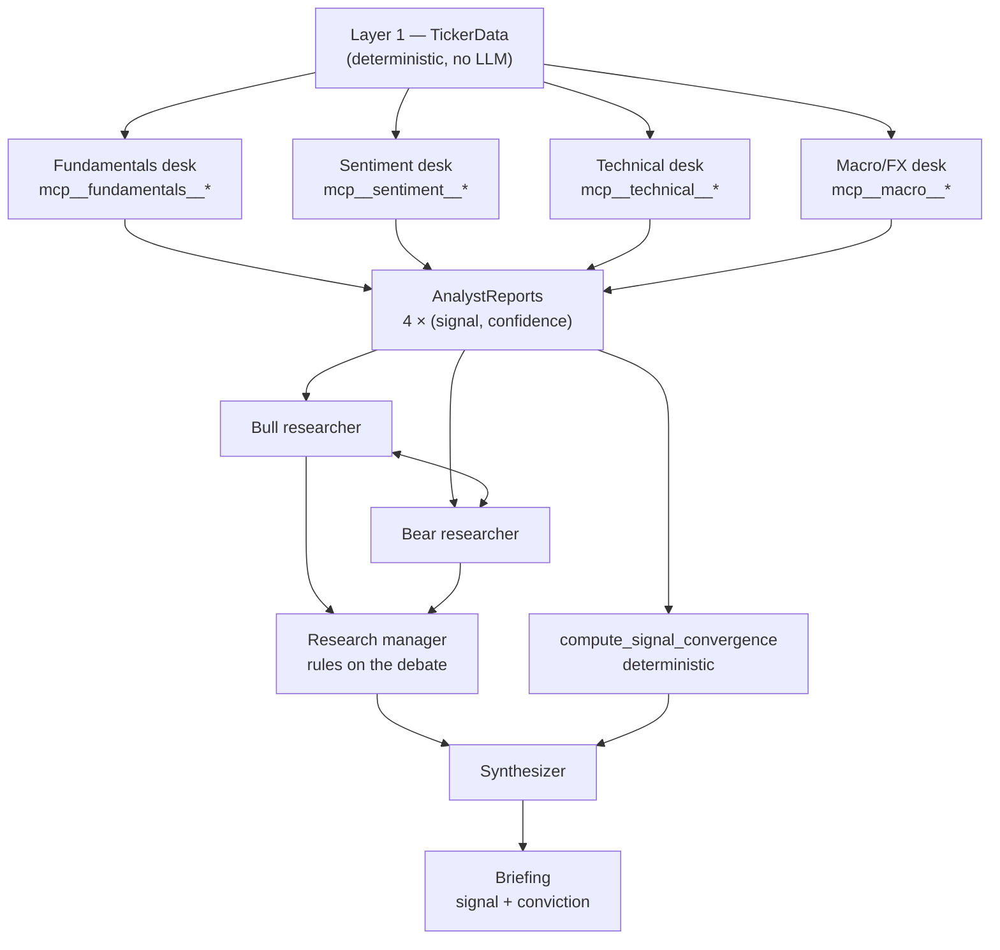

Ask a single model for a view on a stock and you get a good-looking answer. Fluent, balanced-sounding, with a paragraph of risks near the end. What you don't get is any way to tell whether the balance is real or rhetorical — because a single pass has no internal disagreement to expose.

My [stock research pipeline](https://github.com/KelvinYou/ai-stock-analysis) is built around that problem. Four analyst desks run concurrently, each on its own MCP server with its own tools. A bull/bear debate engine argues over their reports for three rounds. A research manager rules on the debate. Only then does a synthesizer write a briefing with a signal and a conviction score.

This post is about why the argument stage exists, and — importantly — why I can't tell you it made the pipeline more accurate.

## The failure mode I was designing against

The single-agent version of this is trivially easy to build. You dump the financials, the technicals, the headlines and a macro summary into one prompt, ask for a research note, and get one back. It reads like something a junior analyst would write. It cites the P/E, notes the RSI, mentions rate sensitivity, and lands on "buy" with moderate confidence.

The problem is what happened inside. The model resolved every tension in the evidence before you saw any of it. If the fundamentals said one thing and the chart said the opposite, that conflict was smoothed into a sentence — and the sentence is not where the information was. The information was in the fact that two independent readings of the same company disagreed.

Confidence is also cheap when nothing contests it. One pass produces the answer *and* its own confidence estimate, from the same context, with the same blind spots. The self-report is not an independent measurement; it's the model grading its own paper.

## Four desks, four MCP servers

The first structural decision is that the analysts genuinely cannot see each other. Not "were told not to look" — there is no channel. Each desk is a separate agent process with its own system prompt, its own MCP server, and an allowlist of exactly the tools on that server.

```python
# src/stock_analysis/agents/base.py
async def analyze(self, ticker_data: TickerData) -> BaseModel:
    """Run the agent and return a validated Pydantic model."""
    tools = self.build_tools(ticker_data)
    server = create_sdk_mcp_server(name=self.name, tools=tools)
    tool_names = [f"mcp__{self.name}__{t.name}" for t in tools]

    schema = self.output_model().model_json_schema()

    options = ClaudeAgentOptions(
        model=self.model,
        system_prompt=self.system_prompt(),
        mcp_servers={self.name: server},
        # MCP tools are supplied explicitly below; no Claude Code
        # filesystem/shell tools are needed by an analyst.
        tools=[],
        allowed_tools=tool_names,
        permission_mode="dontAsk",
        strict_mcp_config=True,
        setting_sources=[],
        output_format={"type": "json_schema", "schema": schema},
        max_turns=5,
    )
```

Three of those settings are the independence guarantee. `tools=[]` strips the default Claude Code toolset, so an analyst has no filesystem and no shell. `allowed_tools` is built from that desk's own server name, so the fundamentals desk can call `mcp__fundamentals__*` and nothing else. `strict_mcp_config=True` with `setting_sources=[]` means no ambient project config can quietly hand it another server.

The result is that "independent" is enforced by the tool boundary rather than by prompt discipline. The fundamentals desk sees ticker info, financial statements, and analyst targets:

```python
# src/stock_analysis/agents/fundamentals.py
return [get_ticker_info, get_financials, get_analyst_targets]
```

The sentiment desk sees headlines and rating changes, and nothing numeric about the balance sheet:

```python
# src/stock_analysis/agents/sentiment.py
return [get_news_headlines, get_analyst_recommendations]
```

Each returns a typed report through a JSON schema derived from a Pydantic model, so every desk lands on the same two comparable fields regardless of what it looked at:

```python
# src/stock_analysis/models/agent_reports.py
class FundamentalsReport(BaseModel):
    signal: Signal
    confidence: Confidence
    pe_assessment: str
    margin_analysis: str
    debt_analysis: str
    growth_outlook: str
    key_risks: list[str]
    key_strengths: list[str]
    summary: str
```

`Signal` is a five-value enum from `strong_buy` to `strong_sell`; `Confidence` is high/medium/low. Four desks, four `(signal, confidence)` pairs, produced without knowledge of each other. That's the raw material the rest of the pipeline works on.

### Why the scoping matters more than it looks

Tool scoping isn't only about tidiness. A desk that could read all the evidence would converge on the same synthesis a single agent produces — you'd have four slightly different voices reaching one consensus, which is a more expensive way to get the same overconfidence.

Restricting the evidence is what makes the signals *diverse* rather than *duplicated*. It also makes a missing input visible instead of imputed. Two desks refuse to run at all when their evidence isn't there:

```python
# src/stock_analysis/agents/sentiment.py
async def analyze(self, ticker_data: TickerData) -> SentimentReport:
    """Do not ask an LLM to invent sentiment when no dated evidence exists."""
    if not ticker_data.news_headlines and not ticker_data.analyst_recommendations:
        return SentimentReport(
            signal=Signal.NEUTRAL,
            confidence=Confidence.LOW,
            news_tone="unavailable",
            news_summary="No point-in-time news or analyst recommendations available.",
            ...
        )
    return await super().analyze(ticker_data)
```

The macro desk does the same when no dated rate/FX snapshot is configured, and its tool payload says so out loud: *"Do not infer current or historical rates, FX, inflation, or geopolitical facts from memory."* A desk that can only see its own evidence is a desk that can be caught having none.

## The debate stage

With four reports in hand, the pipeline does not proceed to a summary. It runs three sequential rounds of a bull researcher and a bear researcher, each arguing from the analyst reports as source facts, each rebutting the other.



The two advocates are asymmetric by construction, and both prompts carry the same guard against theatre:

```python
# src/stock_analysis/debate/engine.py
BEAR_SYSTEM = (
    "You are a skeptical equity researcher identifying every risk and reason NOT to buy. "
    "Your job is to argue AGAINST buying this stock.\n\n"
    "Guidelines:\n"
    "- Identify overvaluation, headwinds, competitive threats, and downside scenarios\n"
    "- Acknowledge strengths only to explain why they are already priced in or unsustainable\n"
    "- When rebutting the bull case, be specific — cite data from the analyst reports\n"
    "- Do not be blindly bearish — your credibility comes from rigorous risk analysis\n"
    "- Structure your response as a clear argument with key points"
)
```

That last-but-one line is doing real work. An advocate told only to argue one side produces something you learn nothing from. The instruction to stay creditable is what turns advocacy into a stress test — the bear has to find the objection that survives contact with the data, not the loudest one.

The debate's output is deliberately not a winner. It's a structured map of the argument:

```python
class DebateResult(BaseModel):
    ticker: str
    rounds: list[DebateRound]
    bull_case_summary: str
    bear_case_summary: str
    key_points_of_agreement: list[str]
    key_points_of_disagreement: list[str]
    unresolved_uncertainties: list[str]
```

`key_points_of_disagreement` and `unresolved_uncertainties` are the fields that don't exist in a single-agent design. There is nowhere in one pass for "here is the thing we could not settle" to live, because the pass has already settled it.

## The research manager rules; it does not average

The debate hands over two advocacy pieces and a neutral map. Judging that and writing the reader-facing briefing are different jobs, and merging them is what put pressure on the synthesizer to pick a direction. So there's a separate adjudication layer:

```python
# src/stock_analysis/debate/research_manager.py
RESEARCH_MANAGER_SYSTEM = (
    "You are a research manager adjudicating a bull/bear investment debate. "
    "You are not an advocate and you are not a summarizer — you rule.\n\n"
    "Guidelines:\n"
    "- Decide which side actually carried the argument on evidence, not on tone "
    "or volume of points\n"
    "- 'neither' is a legitimate ruling when both cases rest on the same "
    "unresolved unknown\n"
    "- State the single strongest counterexample to your own ruling, in full "
    "force — do not soften it\n"
    "- Write invalidation conditions as observable events with thresholds "
    "('gross margin below 40% for two consecutive quarters'), not as vague "
    "risks ('margins could compress')\n"
    "- Separate evidence GAPS (data nobody has) from evidence DISPUTES (data "
    "both sides read differently); only the former belong in evidence_gaps\n"
    ...
)
```

Two of those constraints are the ones I'd defend hardest. `strongest_counterexample` forces the adjudicator to state, at full strength, the best case against its own ruling — a field a confident synthesis has no reason to produce. And `evidence_gaps` captures what neither advocate has any incentive to raise: the bull/bear framing structurally cannot surface "nobody had this data," because naming it weakens whoever names it.

The `invalidation_conditions` field is the one that pays off later. A thesis with falsifiable thresholds attached can be scored against what actually happened; a thesis that says "risks remain" cannot.

## Adjudication under a hard ceiling

The synthesizer merges the reports, the debate, the verdict, and the outcome-memory context into a briefing. It's told the debate is settled and not to re-litigate it:

```python
"The debate is already ruled on — do not re-argue it. Carry the "
"invalidation conditions into your key uncertainties. If you depart "
"from the ruling, state why in your explanation."
```

It's allowed to depart from the ruling. It just has to say so. That's the difference between adjudicating and averaging: the verdict is advisory, the disagreement between the ruling and the mechanical consensus stays visible, and no layer gets to quietly split the difference.

What the synthesizer is *not* allowed to do is set its own confidence. `signal_convergence` is thrown away and recomputed from the four analyst reports:

```python
# src/stock_analysis/synthesis/synthesizer.py
def compute_signal_convergence(analyst_reports: AnalystReports) -> float:
    """Compute confidence-weighted directional agreement deterministically.

    Neutral reports remain in the denominator, so missing or non-directional
    evidence lowers convergence instead of being silently ignored. Strong and
    weak buy/sell labels share the same direction because convergence measures
    agreement, not signal magnitude.
    """
    buy_weight, sell_weight, total_weight = _weighted_directional_totals(analyst_reports)
    if total_weight == 0:
        return 0.0
    return round(max(buy_weight, sell_weight) / total_weight, 4)
```

And the conviction score the model authors is capped by the desks, not trusted on its own terms:

```python
def calibrate_conviction_score(
    signal: Signal,
    model_score: float,
    directional_consensus: float,
) -> float:
    """Cap model conviction by analyst consensus and zero conflicting views."""
    required_direction = _SIGNAL_SIGN[signal]
    if required_direction == 0:
        return 0.0
    if required_direction * directional_consensus <= 0:
        return 0.0
    return round(
        required_direction * min(abs(model_score), abs(directional_consensus)),
        4,
    )
```

A briefing that calls "buy" while the confidence-weighted desks lean net-negative gets a conviction of exactly zero. Not a small number — zero. The independence of the desks is what makes that ceiling meaningful: it's four separately-scoped readings holding the eloquent layer to account, and it's the reason a persuasive debate cannot talk the pipeline into a high-conviction trade.

## What this costs

It is not cheap, and I want to be precise about where the cost lands.

**Latency.** The four desks run concurrently via `asyncio.gather`, so Layer 2 costs one desk's wall-clock. The debate cannot be parallelised — round two's rebuttal needs round one's argument, and the bear needs the bull's turn within the same round. Three rounds is six sequential deep-model calls plus a summary call, then adjudication, then synthesis. The argument is most of the runtime.

**Tokens.** The desks run on Haiku (`quick_think_model`). The debate runs on Opus (`deep_think_model`), and each round re-sends the accumulated history, so context grows every turn. Adjudication and synthesis are Sonnet. The stage I added to reduce overconfidence is also, by a wide margin, the most expensive stage.

**And no accuracy number to show for it.** I have not isolated the debate stage's contribution. Signals are validated walk-forward against a frozen holdout, but that measures the pipeline as a whole; I have never run the ablation — debate on versus debate off, same tickers, same dates — that would let me attribute a difference to the argument. So I'm not going to claim a percentage. The case for the stage is a design case: it produces fields (`key_points_of_disagreement`, `strongest_counterexample`, `evidence_gaps`, `invalidation_conditions`) that a single pass has no place to put, and it caps a fluent layer with independent evidence. Whether that translates into better hit rates is an open question in my own system, and the honest version of this post says so.

There's a knob for exactly that reason. `enable_research_manager=False` drops the adjudicator, and `debate_rounds` is configurable — one round costs a third of three. When it isn't worth it: a run where you only need the four desk signals and the mechanical convergence number, or a screen over a large universe where you want cheap ranking rather than a defensible thesis on each name. Adversarial review earns its keep on the handful of positions you'd actually size, not on the top of the funnel.

## What generalizes

**Independence has to be structural, not instructed.** "Don't look at the other analysis" is a prompt you hope holds. A separate MCP server with a tool allowlist is a boundary that holds whether or not the model cooperates. If you want diverse opinions out of one model family, restrict the evidence each instance can reach.

**Design for fields a confident answer can't produce.** The value of the debate isn't the arguing, it's `unresolved_uncertainties` and `strongest_counterexample` and `evidence_gaps` — slots that only exist because something in the pipeline was structurally required to fill them. A single synthesis has no reason to write down what it couldn't settle. If a schema has nowhere to record disagreement, the disagreement is gone.

**Let the eloquent layer decide, then cap it with arithmetic.** The synthesizer picks the direction and writes the prose, because that's what language models are good at. It does not get to set its own confidence, because that's what they're worst at. Adjudicating with a deterministic ceiling is different from averaging: one preserves a visible disagreement, the other buries it in a mean.

**Say which benefits you've measured and which you've only argued.** I can show you the code that makes the desks independent. I cannot show you a chart proving the argument stage improves accuracy, because I haven't run the ablation. Those are different claims, and a design post that blurs them is doing the same thing the single-agent briefing does — sounding more settled than the evidence supports.
